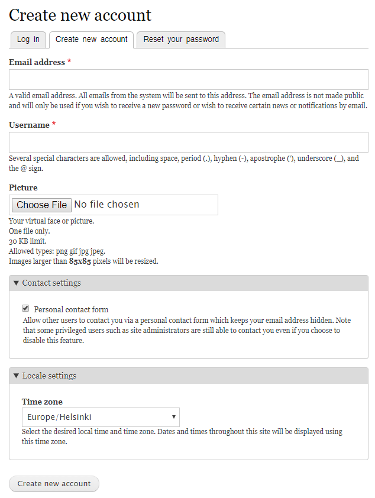
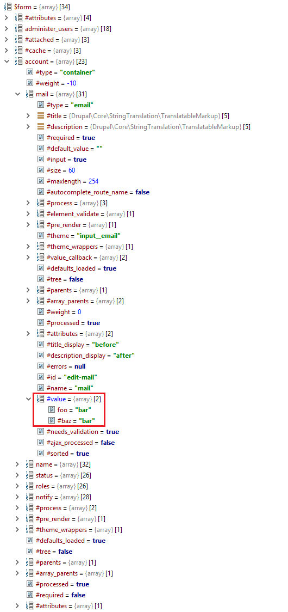

# Introduction

Application programming interfaces (APIs) and frameworks have become a critical part of almost every business. APIs are responsible for transferring information between systems within a company or to external companies. API may be a system API or a library API. Here we talk about web APIs, i.e. APIs provided by web applications. APIs are means through which a client accesses remote services. For example, when you log in to a website like Google or Facebook, an API processes your login credentials to verify they are correct. A framework, or software framework, is a platform for developing software applications. It provides a foundation on which software developers can build programs for a specific platform. For example, a framework may include predefined classes and functions that can be used to process input, manage hardware devices, and interact with system software.

However, given the sensitive data being transferred through APIs, it’s critical to secure them. Moreover, from time to time people find vulnerabilities for versions of widely used frameworks, which puts numerous web apps at risk. Therefore, it's best to be up to date and apply security patches as soon as a new vulnerability arises.

# API Vulnerabilities

By nature, APIs expose application logic and sensitive data such as Personally Identifiable Information (PII) and because of this have increasingly become a target for attackers. PII is any data that could potentially be used to identify a particular person. Examples include a full name, Social Security number, driver's license number, bank account number, passport number, and email address.

## Broken Object Level Authorization

An object refers to a data source that is associated with an authenticated entity. Object-level authorization is all about controlling access based on the scope of permissible user data and object access. A simple physical world example is a hotel room key which is coded to only open the room you paid for, as opposed to a master key used by a maid that opens all the rooms on the floor.
Attackers can exploit API endpoints that are vulnerable to broken object level authorization by manipulating the ID of an object that is sent within the client request. What this means is that the client can request information from an API endpoint that they are not supposed to have access to. This attack normally leads to unauthorized information disclosure, modification, or destruction of data.

**Example Attack Scenario:**

Say for instance there is an e-commerce platform that provides financial and hosted services to a group of different online stores (shops). The platform provides an API used to gain access to revenue charts for each of their hosted stores, and each store should only have access to their own revenue charts. However, while inspecting the client request from a single store who wants to gain access to their own revenue charts, an attacker can identify (find) the API endpoint for those revenue charts and identify the URL in use, for example `/shops/{shop name}/revenue_data.json`. Using the names of other stores being hosted on the e-commerce platform, an attacker can create a simple script to modify the `{shop name}` ID object in subsequent requests, and gain access to the revenue charts of every other store.

## Broken Authentication

Being different from Authorization discussed above, Authentication on the other hand is a complex and confusing mechanism concerning APIs. Since authentication endpoints are exposed to anyone by design, the endpoints that are responsible for user-authentication must be treated differently from regular API endpoints and implement extra layers of protection for credential stuffing attempts, in addition to brute force password and token guessing attacks.

**Example Attack Scenario:**

Suppose that an attacker obtained a list of leaked username/password combinations as the result of a data breach from another organization. If the API endpoint handling authentication does not implement brute force or credential stuffing protections like CAPTCHA, rate-limiting, account lockout, etc., an attacker can repeatedly attempt to gain access using the list of username/password combinations to determine what combination(s) work.

## Excessive Data Exposure

By design, API endpoints often expose sensitive data since they frequently rely on the client app to perform data filtering. Attackers exploit this issue by sniffing the traffic to analyze the responses, looking for sensitive data that should not be exposed. This data is supposed to be filtered on the client app, before being presented to the user.

**Example Attack Scenario:**

Imagine that an IoT-based camera surveillance system allows administrators to add a newly-hired security guard as a system user, and the administrator wants to ensure the new user should only have access to certain cameras. These cameras are accessible via a mobile app that the security guard uses while at work. The newly hired security guard’s mobile app makes an API request to an endpoint in order to receive data about the cameras, and relies on the mobile app to filter which cameras the guard has access to. Although the mobile app only shows the cameras the guard can access, the actual API response contains a full list of all the cameras. Using the sniffed traffic, an attacker can manipulate the API request to show all cameras, bypassing the filtering on the mobile app.

## Lack of Resources & Rate Limiting

It is common to find API endpoints that do not implement any sort of rate limiting on the number of API requests, or they do not limit the type of requests that can consume considerable network, CPU, memory, and storage resources. The amount of resources required to satisfy a request greatly depends on the user input and endpoint business logic. Attackers exploit these issues causing denial-of-service attacks and associated endpoint outages.

**Example Attack Scenario:**

Let’s say that an attacker wants to cause a denial-of-service outage to a certain API that contains a very large list of users. The users’ list can be queried, but the application limits the number of users that can be displayed to 100 users. A normal request to the application would look like this: `/api/users?page=1&size=100`. In this case, the request would return with the first page and the first 100 users. If the attacker changed the size parameter from 100 to 200000, it could cause a performance issue on the backend database, since the size parameter in use is so large. As a result, the API becomes unresponsive and is unable to handle further requests from this or any other client.

## Broken Function Level Authorization

Although different from Broken Object Level Authorization (described above), exploitation of this issue requires the attacker to send API requests to endpoints that they should not have access to, yet are exposed to anonymous users or regular, non-privileged users. These types of flaws are often easy to find and can allow attackers to access unauthorized functionality. For example, administrative functions are prime targets for this type of attack.

**Example Attack Scenario:**

To illustrate this further, imagine that during the registration process to a certain application that only allows invited users to join, the mobile app triggers an API request to GET /api/invites/{invite_guid}. GET is a standard HTTP method used to request information from a particular resource. In this case, the response to the GET contains details about the invite, including the user’s role and email address.

Now, say that an attacker duplicated the request and manipulated the HTTP method by changing GET to POST. POST is an HTTP method used to send information to create or update a resource. The URL would look like this: `POST /api/invites/new/{“email”:”hugo@malicious.com”,”role”:”admin”}`. In this case, the attacker easily exploits this issue and sends himself an email invite to create an admin account.

## Mass Assignment

Modern frameworks encourage developers to use functions that automatically bind input from the client into code variables and internal objects. What this means is that users should have the ability to update their username, contact details, etc. (within their profiles for example), but they should not be able to change their user-level permissions, adjust account balances, and other administrative-like functions. An API endpoint is considered vulnerable if it automatically converts the client input into internal object properties, without considering the sensitivity and the exposure level of these properties. This could allow an attacker to update things that they should not have access to.

**Example Attack Scenario:**

To illustrate this further, imagine that a ride sharing application provides the user the option to edit basic information about themselves in their user profile. For example, they can adjust their username, age, etc. In this case, the API request would look like this: `PUT /api/v1/users/me` with the following legitimate information:

`{"username":"john","age":24}`

However, the attacker determines that the request `GET /api/v1/users/me` includes an additional credit_balance property (field) as shown below.

`{"username":"john","age":24,"credit_balance":10}`

The attacker desires to increase their credit balance on their own and replays the first request with the following payload:

`{"username":"john","age":24,"credit_balance":99999}`

Since the endpoint is vulnerable to mass assignment, the attacker can easily adjust their own `credit_balance` at will, for example changing it from 10 credits to 99999 as shown above.

## Security Misconfiguration

Attackers will often attempt to find unpatched flaws, common endpoints, or unprotected files and directories to gain unauthorized access or knowledge of the system they want to attack. Security misconfigurations can not only expose sensitive user data, but also system details that may lead to full server compromise.

**Example Attack Scenario:**

Say for instance that an attacker uses a popular search engine like Shodan to search for computers and devices directly accessible from the Internet. The attacker found a server running a popular database management system, listening on the default TCP port. The database management system was using the default configuration, which has authentication disabled by default, and the attacker gained access to millions of records with PII, personal preferences, and authentication data.

## Injection

Injection flaws, such as SQL, NoSQL, command injection, etc., occur when untrusted data is sent to an interpreter as part of a command or query. Injection vulnerabilities cause computing systems to potentially process malicious data that attackers introduce. To put it in its simplest terms, attackers inject code into a vulnerable piece of software and change the way the software is intended to be executed. As a result, injection attacks can be somewhat disastrous, since they normally lead to data theft, data loss, data corruption, denial of service, etc.

**Example Attack Scenario:**

Suppose an attacker starts inspecting the network traffic of their web browser and identifies the following API request designed to help a user recover their password. The attacker identifies the request responsible to start the recovery-password process as follows:

`POST /api/accounts/recovery {“email”: “john@somehost.com”}`

Then the attacker replays the request with a different payload:

`POST /api/account/recovery {“email”: “john@somehost.com’;WAITFOR DELAY ‘0:0:5’–“}`

By adding the `;WAITFOR DELAY ‘0:0:5’–”` the attacker observes that the response from the API took ~5 seconds longer, which helps confirm the API is vulnerable to SQL injection. Exploiting the injection vulnerability, the attacker was able to gain unauthorized access to the system.

## Improper Assets Management

Old API versions are often unpatched and can become an easy way to compromise systems without having to fight state-of-the-art security systems, which might be in place to protect the most recent API versions. Attackers may gain access to sensitive data, or even take over the server through old, unpatched API versions connected to the same database.

**Example Attack Scenario:**

Say for instance that an organization redesigning their applications forgot about an old API version (api.someservice.com/v1) and left it unprotected, and with access to the user database. While targeting one of the latest released applications, an attacker found the API address (api.someservice.com/v2). Replacing v2 with v1 in the URL gave the attacker access to the old, unprotected API, exposing the personal identifiable information (PII) of millions of users.

## Insufficient Logging & Monitoring

Without logging and monitoring, or with insufficient logging and monitoring, it is almost impossible to track suspicious activities targeting APIs and respond to them in a timely fashion. Without visibility over ongoing malicious activities, attackers have plenty of time to potentially compromise systems and steal data. Most breach studies demonstrate the time to detect a breach is over 200 days, typically detected by external parties rather than internal processes or monitoring.

**Example Attack Scenario:**

Imagine that a video-sharing platform was hit by a "large-scale" credential stuffing attack. Despite failed logins being logged, no alerts were triggered during the timespan of the attack, and it proceeded without being noticed. As a reaction to user complaints about a possible breach, API logs were analyzed and the attack was detected, way after the fact. The company had to make a public announcement asking users to reset their passwords, and report the incident to their regulatory authorities.

# Framework Vulnerabilities

Web application framework is a collection of pieces of software designed to ease the development of web applications. Web application frameworks provide common solutions for a wide variety of tasks such as database access, input filtering for security purposes, authentication, session handling and templates for website development.

There are several different types of web application frameworks:
* General purpose website frameworks (Ruby On Rails)
* Discussion forums, wikis and weblogs (WikiBase/WikiWikiWeb)
* Organizational portals (JBoss Portal)
* Content Management Systems (CMS) (Joomla, Drupal, Wordpress)

When performing a security audition (or hacking) of a website it is necessary to identify the implementation technologies of the target. This identification can be done manually or more commonly using automated tools, such as [BuiltWith](https://builtwith.com/) and [Wappalyzer](https://www.wappalyzer.com/). Once the web application framework is detected further penetration steps depend on the framework. Quite a few websites are done with CMSs and contain no application-specific custom code. For these applications, identifying the CMSs modules used and their version is necessary. This information can be used further to search for vulnerabilities or perform a manual code inspection of the modules used. Finding a security flaw usually means that the website has not been properly updated. If a manual inspection of CMS modules reveals vulnerabilities, it is very likely that these modules are used in other websites, which makes them vulnerable as well.

The most widely used web Frameworks provide lots of security mechanisms by default - for example,  Django provides protection for SQL injection, XSS injection, clickjacking and many more. However, from time to time vulnerabilities are found and attackers have numerous possible targets, since some of these frameworks are extremely popular.

The rest of the section contains examples of vulnerabilities found in various framework versions.

## Laravel

Laravel is one of the [most preferred](https://customerthink.com/what-makes-laravel-the-most-preferred-php-framework-for-web-development/) PHP Frameworks for Web Development.

In 2019 a vulnerability was found for the popular Laravel-query-builder package. Due to the way Laravel builder parses the string to query, the hacker can leverage this to attack the application with an SQL Injection attack.

The package is parsing the URLs to add some filters to the queries.

For example, if you want to sort the articles by title:

`https://example.com/articles?sort=title`

You may use the following code to automatically sort by the package:

`use Spatie\QueryBuilder\QueryBuilder;`

`$articles = QueryBuilder::for(Article::class)->get();`

This will be translated into:

`Article::orderBy('title')->get();`

And the underlined SQL query will be:

`SELECT * FROM 'articles' ORDER BY 'title' ASC`

The attacker can take advantage of this transformation to perform an SQL Injection attack, by changing the URL to:

`https://example.com/articles?sort=title->"%27))injectedSQL`

Since Laravel supports queries in JSON fields, it will guess that you want to query json `title->` so it replaces `->` with JSON MySQL functions. The attacker closes the function brackets `))` and adds his injected SQL.

The final command:

`SELECT * FROM articles ORDER BY json_unquote(json_extract(title, '$.""'))`**`injectedSQL`**`"')) ASC`

**Vulnerable versions:**

Laravel 5.6/5.7/5.8 with Laravel-query-builder < v1.17.1
Laravel 5.5 with Laravel-query-builder < v1.16.1

## Drupal

Drupal is a free and open-source web content management framework written in PHP. Drupal provides a back-end framework for at least 2.3% of all websites worldwide – ranging from personal blogs to corporate, political, and government sites. According to builtwith.com, 473 of the Quantcast top 10,000 websites use Drupal, and that number jumps up to 4,341 when you look at the top 100,000.

Drupal introduced a Form API in Drupal 6 which allowed alteration of the form data during the form rendering process. In 2018, Drupal released a patch adding just a single class, _RequestSanitizer_, with a _stripDangerousValues_ method that unsets all the items in an input array for keys that start with a hash sign. This method sanitizes input data in $_GET, $_POST & $_COOKIES during the very early stages of Drupal’s bootstrap (immediately after loading the site configurations). It can be assumed that the reason why the patch was released is to make an existing vulnerability harder to find.

The vulnerability was found in the forms. The user registration form which requires no authentication and can be accessed anonymously contains multiple input fields and can be exploited.

It was highly probable that injecting a renderable array would exploit the vulnerability, the question was where?

As it turns out, the “Email Address” field doesn’t sanitize the type of input it receives which allows hackers to inject the renderable array to the form array structure. Renderable arrays contain metadata that is used in the rendering process.

Since Drupal treats the injected array as a value and not as an element, attackers need to trick Drupal into rendering it. Drupal renders an array on page load events or via Drupal AJAX API.

The "Picture" field of the user registration form uses Drupal’s AJAX API to upload a picture and replace it with a thumbnail of the uploaded image.

What's more important about this attack is that a Russian Security Researcher posted a [POC](https://github.com/a2u/CVE-2018-7600/blob/master/exploit.py) on Github and soon after numerous people started using it to install cryptocurrency miners and malware backdoors.

**Vulnerable versions:**

Drupal < 8.3.9 / < 8.4.6 / < 8.5.1 ~ user/register URL, attacking account/mail & #post_render parameter, using PHP's passthru function
Drupal < 7.58 ~ user/password URL, attacking triggering_element_name form & #post_render parameter, using PHP's passthru function

## WordPress

Details of a serious Denial of Service (DoS) vulnerability in WordPress have been published by an Israeli security researcher named Barak Tawily. This vulnerability can be used to take down a website in a matter of minutes.

The vulnerability is listed on the CVE (Common Vulnerabilities and Exposures) website as CVE-2018-6389 and on Exploit DB as exploit number 43968. Barak Tawily first wrote about it on February 5, 2018 on his blog.

This issue is related to a file called load-scripts.php, which is a part of the WordPress core. This file is used to improve the performance by loading multiple external JavaScript (JS) files in a single request.

Barak first noticed the problem when he saw an unusual URL that was loading when he visited certain WordPress pages. That URL was:

`https://DOMAINNAME/wp-admin/load-scripts.php?c=1&load%5B%5D=jquery-ui-core&ver=4.9.1`

He noticed that the load-scripts.php file was receiving a parameter called load[]. This parameter is an array that was receiving the names of the JS files that needed to be loaded. In this case, it was receiving jQuery UI Core, which is the name of one of the Javascript files used by the WordPress login page.

Because WordPress is an open source platform, it was simple for Barak to review the application’s code and determine precisely how WordPress loaded these files. He discovered that load-scripts.php file was designed to economize the loading of external JS files. Another file, called load-styles.php, was doing the same thing for Cascading Style Sheet (CSS) files.

This feature allowed the browser to receive multiple files with a single request, dramatically improving the load time of each admin page. Although it was only designed for use on admin pages, it was also being used on the login page — before the user had been authenticated. This oversight is responsible for the vulnerability.

He continued to explore the source code of WordPress and discovered that there is a variable that contains a defined list of scripts that can be loaded. If one of the names in the load[] array matches one of these script names, the server will perform an I/O read action to load it. The list of scripts that are available is defined in a file called script-loader.php. It includes 181 different scripts. The server took ~2.2 seconds to gather the files, merge them into one file, and send them to the browser. After performing 500 requests, the server was overloaded and became unable to respond to subsequent requests. He posted a [video](https://www.youtube.com/watch?v=nNDsGTalXS0&feature=youtu.be) showing how quickly it could be used to take down a WordPress website.

# Further Reading

* Metropolia University of Applied Sciences
* https://blog.papertrailapp.com/common-api-vulnerabilities-and-how-to-secure-them/
* https://techterms.com/definition/framework
* https://owasp.org/www-project-api-security/
* https://www.checkmarx.com/blog/breaking-down-owasp-api-security-top10-part1
* https://securityboulevard.com/2020/01/breaking-down-the-owasp-api-security-top-10-part-2/
* https://shieldfy.io/blog/serious-sql-injection-vulnerability-in-laravel-query-builder/
* https://research.checkpoint.com/2018/uncovering-drupalgeddon-2/
* https://www.secpod.com/blog/drupalgeddon-2/
* https://blog.threatpress.com/wordpress-vulnerability-dos/
* https://freek.dev/1317-an-important-security-release-for-laravel-query-builder

# Activities

**1.** [Clean up](https://sss-ctf.security.cs.pub.ro/challenges?category=web-sessions)
**2.** [High Score](https://sss-ctf.security.cs.pub.ro/challenges?category=web-sessions)
**3.** [Snoop Doggy Dogg](https://sss-ctf.security.cs.pub.ro/challenges?category=web-sessions)
**4.** [The Accountant](https://sss-ctf.security.cs.pub.ro/challenges?category=web-sessions)
