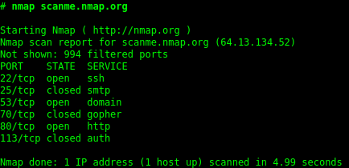

# Recon & Enumeration & Recap

Security Summer School

---

## Penetration Testing

penetration tester / pentester

1. **reconnaissance** - gather information about the target: tech, subdomains, open ports, OSINT
2. **scanning** - manual/automatic discovery (XSS, SQLi)
3. **gaining access** - exploiting the vulns discovered
4. ***maintaining access** - backdoors
5. ***covering tracks** - remove evidence of the attack
6. **reporting** - report findings by severity (critical-low)

----

## Reconnaissance
- Attack surface
- Automatic & Manual discovery

----

## Ports - like holes in a system

* 0 - 65535
* 0 - 1023 well-known ports

----

## Ports - like holes in a system

* 0 - 65535
* 0 - 1023 well-known ports
* http://example.com ⇔ example.com:80
* https://example.com ⇔ example.com:443
* 22 - SSH
* 20/21 - FTP
* 25 - SMTP

----

## Nmap

DEMO

----

## Shodan Search Engine

https://www.shodan.io

- Searches for devices connected to the Internet

- Various search filters: port, city, IP etc.

----

## Scanning

----

## OWASP

- OWASP Top 10

- OWASP ZAP # DEMO

----

## Gaining access through enumeration

- Brute forcing the login form

- Demo: Burp Intruder

----

## Wordlists

- Wordlists are your best friend

https://github.com/danielmiessler/SecLists/blob/master/Passwords/Common-Credentials/10k-most-common.txt

https://github.com/trickest/wordlists 

----

## Default credentials

https://github.com/ihebski/DefaultCreds-cheat-sheet/

----

## Types of brute force attacks

- Dictionary Attack

- Password Spray Attack

- Credential Stuffing

- and others

----

## Dictionary Attack

<pre><code data-trim>
for username in usernames:
    for password in passwords:
        try username:password
</code></pre>

<pre><code data-trim>
E.g.
usernames = [user1, user2]
passwords = [pass1, pass2]
Try: user1:pass1, user1:pass2, user2:pass1, user2:pass2
</code></pre>

----

## Password-Spray Attack

<pre><code data-trim>
for password in passwords:
    for username in usernames:
        try username:password

    if attempts_per_period reached:
        sleep(lockout_period)
</code></pre>

<pre><code data-trim>
E.g.
usernames = [user1, user2, user3]
passwords = [pass1, pass2, pass3]
attempts_per_period = 1
lockout_period = 5
Try: pass1:user1, pass1:user2, pass1:user3,
sleep(5), pass2:user1, ...
</code></pre>

----

## Credential Stuffing Attack

<pre><code data-trim>
for (username, password) in zip(usernames, passwords):
        try username:password
</code></pre>

<pre><code data-trim>
E.g.
usernames = [user1, user2]
passwords = [pass1, pass2]
Try: user1:pass1, user2:pass2
</code></pre>

----

## Subdomain Enumeration
- find other interesting targets
- subfinder, assetfinder demo

----

## Web Content Enumeration / Discovery / Scanning / Dirbusting

----

## Web Content Enumeration / Discovery / Scanning / Dirbusting

- usually GET/HEAD requests
- input wordlist: Common config filenames etc.
- goal: finding (hidden/useful) files/resources on the server
- ffuf, dirsearch demo

----

## Common configuration files publicly available

Database dumps, Backups

E.g.:
* /viewdoc.bak => code source of viewdoc.jsp
* /server.log => full paths on the server, system information
* /package.json => file created for Node.js projects
* /php.ini (inside cgi-bin/) => sensitive information about the server, database credentials

----

## Hard 404 vs Soft 404

----

## Hard 404

https://website.com/randomidheowuhfgy => 404 Not Found => Hard 404
+ Also 410 Gone

----

## Soft 404

https://website.com/randomidheowuhfgy => any other HTTP code :)

Examples:
1. 200 OK + custom 404 page
2. 301 Moved Permanently (page have existed once, then was moved)
3. 5xx Server Error
4. Redirect e.g. to login page, or to home page
5. ...

----

## Web Fuzzing (Dirbusting++)

- all kinds of requests
- payload can be inserted anywhere: query, body, headers
- input wordlist: fuzzing wordlist (random, unexpected payloads)
e.g. ;#, foreign language, very long words
- goal: find resources on the server + trigger unexpected behaviour?

----

## Tools

### Web content scanners:
* DIRB - not maintained anymore, but easy to use
* DirBuster - GUI, not maintained anymore
* DirSearch - there are better alternatives

### Fuzzers:
* FFUF
* Wfuzz
* GoBuster

### Commercial:
* Burp Intruder

----

## Bug Bounty

https://www.bugcrowd.com/bug-bounty-list/

https://hackerone.com/bug-bounty-programs

https://github.com/projectdiscovery/public-bugbounty-programs/blob/master/chaos-bugbounty-list.json

----

## SUMMARY
- get target in **scope**
- map **attack surface**
- automated scanning + manual validation
- find "hidden" content
- try targeted **wordlists**
- reading documentation gives you superpowers
- **verify** tool source code & output

----

## Challenges
- lamer-login
- not-so-random

For further practice:
- ginandjuice.shop
- DVWA

----