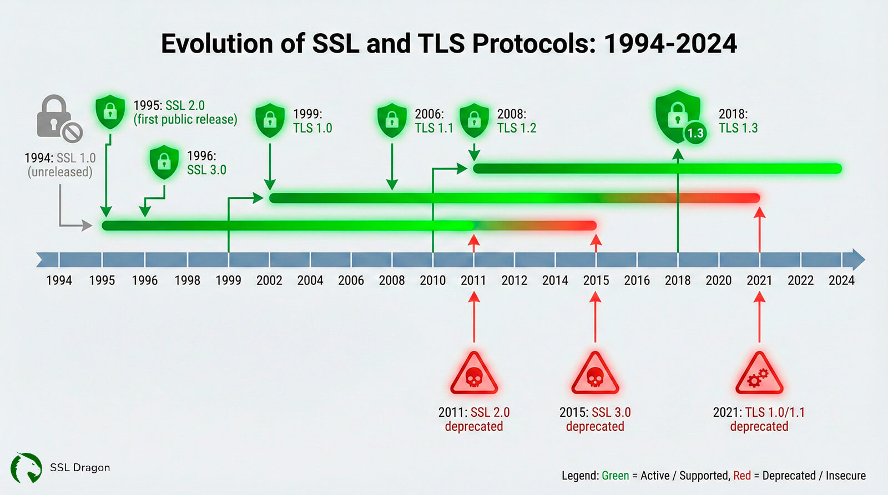
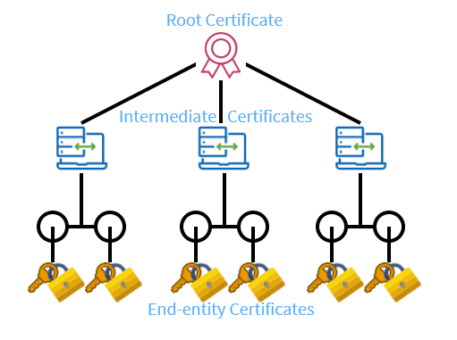
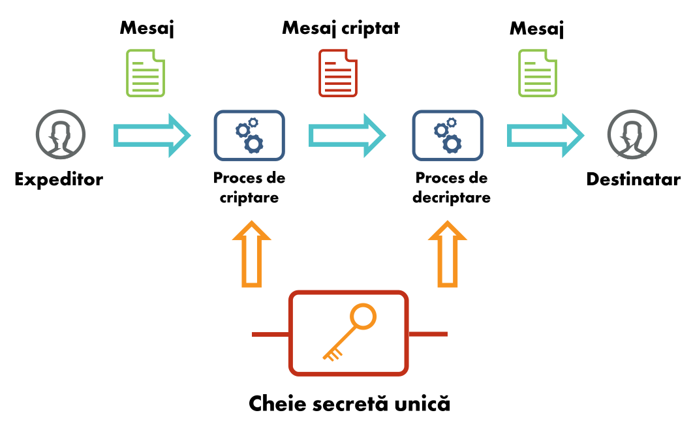
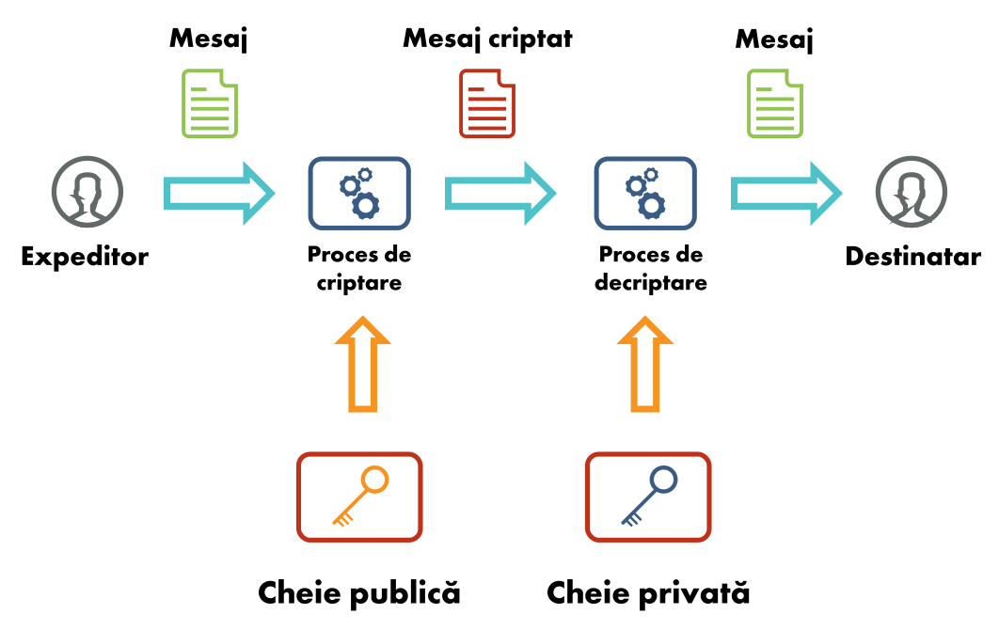

# Securing Communication

Security Summer School

---

# HTTP vs HTTPS

---

Hypertext Transfer Protocol (Secure)

---

* HTTP is plain text

---

* doesn't maintain an active session
    - request/response based, using cookies
    - phonecall vs SMS analogy

---

# SSL, TLS

---

HTTPS = HTTP + SSL/TLS 🛡️

---

[https://www.ssldragon.com/blog/history-of-ssl-tls-versions/](https://www.ssldragon.com/blog/history-of-ssl-tls-versions/)

---

## Tools for SSL Vulnerability Scanning

* [SSL/TLS Scanner from Pentest-Tools.com](https://pentest-tools.com/network-vulnerability-scanning/ssl-tls-scanner/scans/pskglFnpfOe8VerF?view_report=true)
* [SSL Test from Qualys](https://www.ssllabs.com/ssltest/)
* [testssl.sh](https://github.com/drwetter/testssl.sh)

---

HTTP Strict Transport Security (HSTS)

---

1. Encryption management
2.

---

1. Encryption management
2. **Identity management**

---

- certificates

---

- stored locally on PC
- stored in browser
- _usually_ the same

---

[https://www.keyfactor.com/blog/certificate-chain-of-trust/](https://www.keyfactor.com/blog/certificate-chain-of-trust/)

---

`openssl` tool

---

## Retrieve certificates

`openssl s_client -showcerts -connect www.google.com:443 -servername www.google.com`

---

# Inspect details of certificate

`openssl x509 -noout -subject -issuer -in certificate.crt`

---

# Verify certificate

`openssl verify -CAfile CA.crt certificate.crt`

---

## Encryption types

1. Symmetric encryption
2. Public-key (asymmetric) encryption

---

## Symmetric encryption

- a key is shared among the two ends in the communication
- the same key used for both *encrypting* and *decrypting* data

---

<a href=https://raw.githubusercontent.com/open-education-hub/web-security/refs/heads/main/chapters/network-and-communication-security/securing-communication/media/symmetric-encryption.svg>source</a>

---

## Public key (asymmetric) encryption

Each entity has a pair of (private key, public key).
1. private key generation -> random
2. public key generation -> from the private key (_maths_)
3. anyone can **encrypt** a message using the **public** key
4. only the owner can **decrypt** the message using the **private** key

---

<a href=https://raw.githubusercontent.com/open-education-hub/web-security/refs/heads/main/chapters/network-and-communication-security/securing-communication/media/public-key-encryption.svg>source</a>

---

Which one is better (symmetric vs asymmetric)?

---

Which one is used in TLS?

---

Which one is used in TLS? -> **A mix**.

---

- symmetric encryption but with a **temporary** _session key_
- public-key encryption is only used at the beginning, to exchange the key used for that session
- [TLS handshake](https://www.cloudflare.com/learning/ssl/how-does-ssl-work/)
- [Diffie-Hellman](https://en.wikipedia.org/wiki/Diffie%E2%80%93Hellman_key_exchange)
