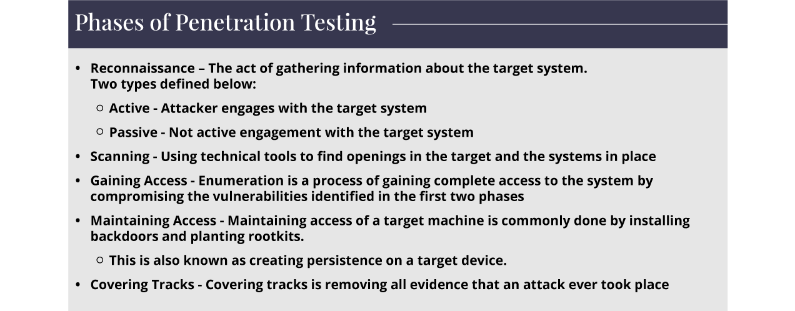
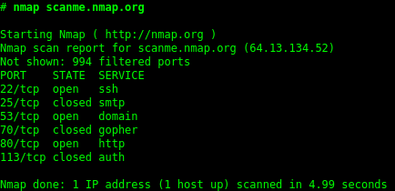
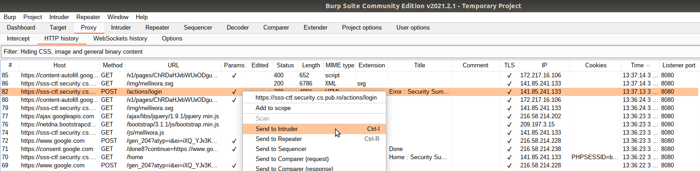
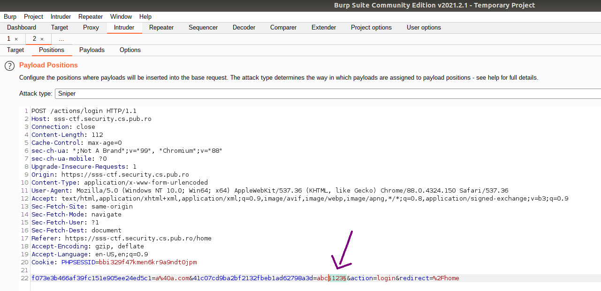
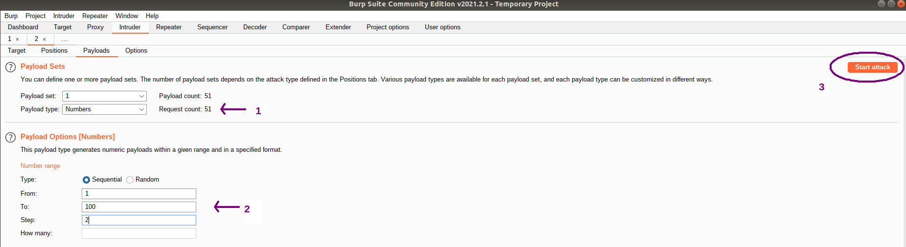
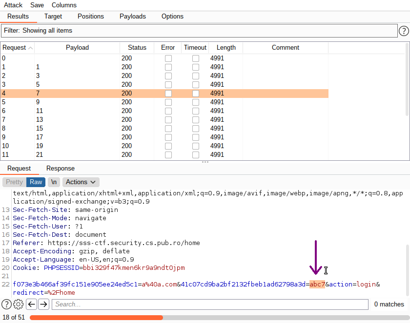
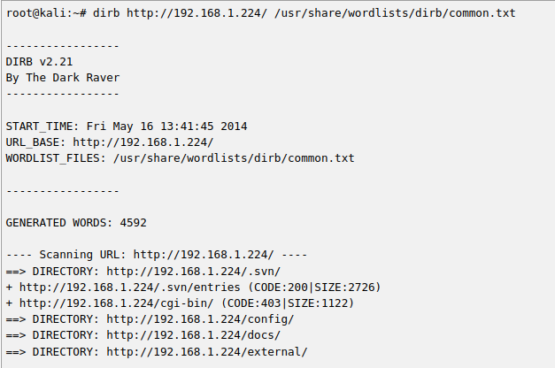

# Recon & Enumeration & Recap

When it comes to hacking, knowledge is power.
The more knowledge you have about a target system or network, the more options you have available.
This session will put together all you have learned so far to give you an overview of how to approach a given target you want to exploit.
You will also find out about some more security tools that can help you automate the process.

## Phases of Penetration Testing

Penetration testing is an authorized simulated cyber attack on a computer system, performed to evaluate its security.

A standard penetration testing flow implies 5 stages:
1. **reconnaissance** - gathering information about the target system: website technologies, subdomains, open ports, Google hacking
1. **scanning** - manually or automatically (using tools) discovering vulnerabilities in the system, like SQL injection, XSS etc.
1. **gaining access** using enumeration - exploiting the vulnerabilities found before to collect sensitive information: usernames, machine names, network information, service settings
1. **maintaining access** - planting hidden programs (like Trojan horses) that make a future attack easier
1. **covering tracks** - cleaning up all the signs that may lead to thinking that an attack happened

Next, we introduce some popular tools that may help in the first three phases, to gather information about a target.
Exploiting Tools/ Security Testing Tools/ Penetration Testing Tools are used for the discovery of vulnerabilities without attempting to actually exploit them.

# 1. Reconnaissance

Reconnaissance is an important first stage in any ethical hacking attempt.
Before it is possible to exploit a vulnerability in the target system, it is necessary to find it.
By performing reconnaissance on the target, an ethical hacker can learn about the details of the target network and identify potential attack vectors.

## Nmap
[Nmap](https://insecure.org/) is probably the most well-known tool for active **network** reconnaissance.
It is a network scanner designed to determine details about a system and the programs running on it.

Every computer has a total of 65535 available ports; however, many of these are registered as standard ports.
For example, a HTTP web service can nearly always be found on port 80 of the server.
A HTTPS web service can be found on port 443.
If we do not know which of these ports a server has open, then we do not have a hope of successfully attacking the target; thus, it is crucial that we begin any attack with a port scan.
Nmap can be used to perform many different kinds of port scan; the basic theory is this: it will connect to each port of the target in turn.
Depending on how the port responds, it can be determined as being _open_, _closed_, or _filtered_ (usually by a firewall).
Once we know which ports are open, we can then look at _enumerating_ which services are running on each port – either manually, or more commonly using nmap.

Typing the simple command `nmap` will display all of its options for scanning, while `nmap <target>` will convert the hostname to an IP address and scan the top 1000 TCP ports, displaying their state and the service running on it:

You can see the full example [here](https://nmap.org/book/port-scanning-tutorial.html) and practice more Nmap options [here](https://tryhackme.com/room/rpnmap).

## Shodan

[Shodan](https://www.shodan.io/) is a search engine similar to Google.
But while Google searches for websites, Shodan searches for devices that are connected to the internet - from routers and servers, to Internet of Things (IoT) devices, such as thermostats and baby monitors, to complex systems that govern a wide range of industries, including energy, power, and transportation.
You can use a variety of search filters: port, IP address, city etc.
If your internet-facing devices aren’t protected, Shodan can tell hackers everything they need to know to break into your network.

# 2. Scanning

## OWASP Zap

The [Open Web Application Security Project](https://owasp.org/) (OWASP) is a nonprofit foundation that works to improve the security of software.
The [OWASP Top 10](https://owasp.org/www-project-top-ten/) is a standard awareness document for developers and web application security.
It represents a broad consensus about the most critical security risks to web applications and is updated every 3 years.

Developed by OWASP, [ZAP](https://www.zaproxy.org/) or Zed Attack Proxy is a multi-platform, open source web application security testing tool. ZAP is used for finding a number of security vulnerabilities in a web app during the development as well as testing phase.
Other than its use as a scanner, ZAP can also be used to intercept a proxy for manually testing a web page.
ZAP can identify:
* Application error disclosure
* Cookie not marked with the HttpOnly flag
* Missing anti-CSRF tokens and security headers
* Private IP disclosure
* Session ID in URL rewrite
* SQL injection
* XSS injection

You can read about other active recon tools [here](https://resources.infosecinstitute.com/topic/top-10-network-recon-tools/#gref): Nessus, OpenVAS, Nikto, Metasploit, [Pentest-Tools Website Scanner](https://pentest-tools.com/website-vulnerability-scanning/website-scanner).

# 3. Enumeration

## Extracting common passwords - Burp Intruder

You were introduced to Burp Proxy in an earlier session.
Now we'll see an example of how to use Intruder in order to enumerate passwords.
With Burp Intruder, customized attacks can be automated against web applications.
Customizing attacks requires that we specify one or more payloads and the position where the payloads will be placed in the website.

* I opened Burp and the built-in Chromium browser (or your browser of choice, but pay attention to setting up the proxy), having the intercept **off**.
* I navigated to https://sss-ctf.security.cs.pub.ro/home and tried to log in using the email **a@a.com** and the password **abc123**.
* The POST request can be found in HTTP history. Right click on it to send it to Intruder.

* Let's say we want to try all the passwords from **abc1**, **abc3**, **abc5**... to **abc100**. Navigate to the **Positions** tab - the payload position is specified with a pair of these characters: **§** called **payload markers**.

**Note!** By default, Burp surrounds by default some parameter values which might be candidates for enumeration, such as cookie values, or POST data values.
Remove the extra **§** characters, leaving it like in the picture below.

1. Our payload type (wordlist) is a sequence of numbers which can be automatically generated in Burp. Go to the **Payloads** tab and select **Numbers** as the **Payload type**.
1. Fill in the Payload options to generate all the numbers from 1 to 100, with step 2 (1, 3, 5...).
1. Finally, launch the attack.

A new window opens and you can see all the requests Burp is making, with the payloads you specified.
For example, you can check the request corresponding to the payload 7, with the resulting password being **abc7**, and you can observe the response, its status code, or even open it in the browser.

There are many ways in which you can customize this process according to your needs.
You can have multiple payload positions and select from four attack types, specifying how to insert the payloads (one different wordlist for each position, or combinations of them).
Find more details [here](https://portswigger.net/burp/documentation/desktop/tools/intruder/positions).
* **Sniper** - This uses a single set of payloads.
It targets each payload position in turn, and places each payload into that position in turn.
Positions that are not targeted for a given request are not affected - the position markers are removed and any enclosed text that appears between them in the template remains unchanged.
This attack type is useful for fuzzing a number of request parameters individually for common vulnerabilities.
The total number of requests generated in the attack is the product of the number of positions and the number of payloads in the payload set.
* **Battering ram** - This uses a single set of payloads.
It iterates through the payloads, and places the same payload into all of the defined payload positions at once.
This attack type is useful where an attack requires the same input to be inserted in multiple places within the request (e.g. a username within a Cookie and a body parameter).
The total number of requests generated in the attack is the number of payloads in the payload set.
* **Pitchfork** - This uses multiple payload sets.
There is a different payload set for each defined position (up to a maximum of 20).
The attack iterates through all payload sets simultaneously, and places one payload into each defined position.
In other words, the first request will place the first payload from payload set 1 into position 1 and the first payload from payload set 2 into position 2; the second request will place the second payload from payload set 1 into position 1 and the second payload from payload set 2 into position 2, etc.
This attack type is useful where an attack requires different but related input to be inserted in multiple places within the request (e.g. a username in one parameter, and a known ID number corresponding to that username in another parameter).
The total number of requests generated in the attack is the number of payloads in the smallest payload set.
* **Cluster bomb** - This uses multiple payload sets.
There is a different payload set for each defined position (up to a maximum of 20).
The attack iterates through each payload set in turn, so that all permutations of payload combinations are tested. I.e., if there are two payload positions, the attack will place the first payload from payload set 2 into position 2, and iterate through all the payloads in payload set 1 in position 1; it will then place the second payload from payload set 2 into position 2, and iterate through all the payloads in payload set 1 in position 1.
This attack type is useful where an attack requires different and unrelated or unknown input to be inserted in multiple places within the request (e.g. when guessing credentials, a username in one parameter, and a password in another parameter).
The total number of requests generated in the attack is the product of the number of payloads in all defined payload sets - this may be extremely large.

There are also many different types of payloads you can use ([here](https://portswigger.net/burp/documentation/desktop/tools/intruder/payloads/types) is the entire list), from specifying your own list of words to generating random bytes.
You can find lists of popular credentials online, for instance, [here](https://github.com/danielmiessler/SecLists/tree/master/Passwords) is a repo with lists of most used passwords.

## Web Content Enumeration/ Web Content Discovery/ Dirbusting

Let's say we have the target server **https://security.cs.pub.ro/** and we want to discover hidden files, directories or other resources there.
Manually, we would make multiple requests like _https://security.cs.pub.ro/docs_, _https://security.cs.pub.ro/config.php_ etc. or whatever we imagine might find and see if we get a 404 Not Found response or not.
Luckily, there are command line tools and predefined wordlists in Kali (**/usr/share/wordlists/**) doing exactly this for us.

### DIRB
[DIRB](https://tools.kali.org/web-applications/dirb) is a Web Content Scanner, a Kali built in tool.
It looks for existing (and/or hidden) Web Objects.
It basically works by launching a dictionary based attack against a web server and analyzing the response.
DIRB comes with a set of preconfigured attack wordlists for easy usage but you can use your custom wordlists.
For each filename, it checks the existence on the web server and returns the results which do not give a 404 Not Found response.

Usage example: `./dirb <url_base> [<wordlist_file(s)>] [options]`

The output lines with the results found (not 404) start with a `+` and give details about status code and page size.

You can read the documentation if you want to specify custom options, like custom file extensions to look for.

### Similar tools
* [DirBuster](https://tools.kali.org/web-applications/dirbuster) - not maintained anymore, Kali built in, written in Java.
The only one with a GUI and not a CLI.
* [DirSearch](https://www.kali.org/tools/dirsearch/) - Kali built in & on [GitHub]((https://github.com/maurosoria/dirsearch)), written in Python.
* [GoBuster](https://tools.kali.org/web-applications/gobuster) - Kali built in & on [GitHub](https://github.com/OJ/gobuster), written in Go.
Can do DNS and VHost busting, S3 buckets enumeration.
* [wfuzz](https://github.com/xmendez/wfuzz) - on GitHub, written in Python, can be easily installed with pip.
* [ffuf](https://github.com/ffuf/ffuf) - on GitHub, written in Go, has the option to mutate the files found.
Can do VHost discovery.

You can find a detailed comparison [here](https://blog.sec-it.fr/en/2021/02/16/fuzz-dir-tools/).
We don't recommend DirBuster and DirSearch since the others are newer, improved and better-maintained tools.
DIRB is also not maintained anymore, but can come in handy if you want to do a quick content discovery, with not many options to configure.

## Recap with DVWA

DVWA (Damn Vulnerable Web Application) is a deliberately vulnerable application which you can use to test your skills and exploit some of the most common web vulnerabilities, like XSS, SQL, LFI, with various difficulty levels.

### Setup instructions

An easy way to deploy DVWA is by using [Docker](https://docs.docker.com/get-docker/), which you need to have installed on your machine.
Then, follow the instructions from [here](https://hub.docker.com/r/vulnerables/web-dvwa/).
After running it, you can simply access it in your browser at http://127.0.0.1:80 (or a different port, if you wish), login and start hacking.

### Solutions
* Brute force: https://medium.com/cyberdefendersprogram/burp-suite-webpage-enumeration-and-vulnerability-testing-cfd0b140570d
* SQL Injection: https://medium.com/cyberdefendersprogram/burp-suite-webpage-enumeration-and-vulnerability-testing-cfd0b140570d
* Blind Sql: https://medium.com/hacker-toolbelt/dvwa-1-9-viii-blind-sql-injection-with-sqlmap-ee8d59fbdea7
* CSRF: https://medium.com/hacker-toolbelt/dvwa-1-9-iv-csrf-b9f2409fd628
* File Upload: https://medium.com/hacker-toolbelt/dvwa-1-9-vi-file-upload-ce77a73b0453

# Further Reading
* https://www.safetydetectives.com/blog/what-is-shodan-and-how-to-use-it-most-effectively/
* https://hackr.io/blog/top-10-open-source-security-testing-tools-for-web-applications
* https://www.knowledgehut.com/blog/security/enumeration-in-ethical-hacking
* https://www.greycampus.com/opencampus/ethical-hacking/enumeration-and-its-types

### Wordlists
* https://github.com/Bo0oM/fuzz.txt
* https://github.com/aels/subdirectories-discover
* https://github.com/danielmiessler/SecLists

### Bug Bounty Program Lists
* https://github.com/projectdiscovery/public-bugbounty-programs/blob/master/chaos-bugbounty-list.json
* https://www.bugcrowd.com/bug-bounty-list/
* https://hackerone.com/bug-bounty-programs

# Activities

1. [Not So Random](https://sss-web.cyberedu.ro)
2. [Lamer Login](https://sss-web.cyberedu.ro)
3. [DVWA](https://hub.docker.com/r/vulnerables/web-dvwa/)
