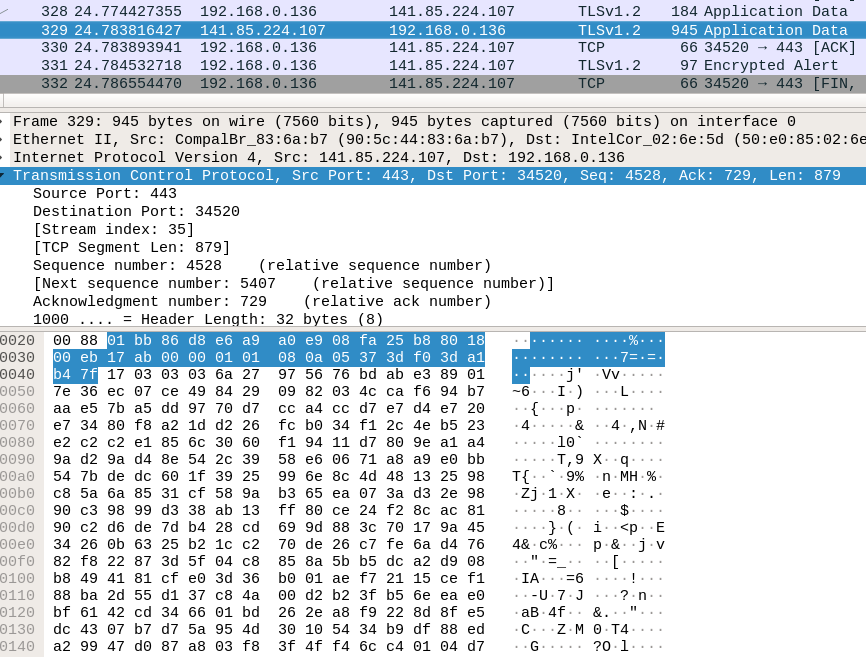
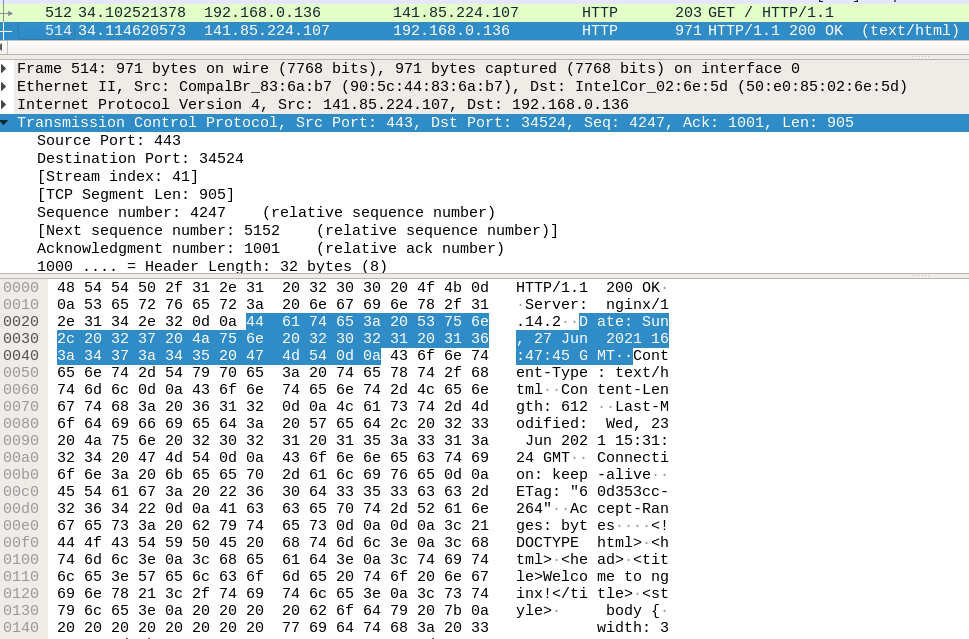

# Securing Communication

## Introduction

As part of this session, we look into how HTTP connections can be made secure, to prevent attacks that capture traffic, also called man-in-the-middle (MitM) attacks.
The session is focused on understanding certificates and HTTPS and investigating configurations of existing setups.

## Reminders and Prerequisites

HTTP (*Hypertext Transfer Protocol*) is the main protocol of the web.
It has several characteristics:
* it is plain text
* it doesn't maintain an active connection
* it's a request-response protocol
* it provides a series of codes to mark the type of request and replies
* HTTP requests consists of paths (routes) that are mapped to resources

The lack of an active connection session is compensated by the use of cookies.
Similarly, the plain text nature of the protocol means that anyone could read contents in HTTP network packets.
This is alleviated by the use of HTTPS.
Nowadays, most connections use HTTPS precisely because of the need for confidentiality.

In the previous session, you used web browsers and the [Developer Tools](https://developer.mozilla.org/en-US/docs/Learn/Common_questions/What_are_browser_developer_tools) feature of modern browsers to inspect traffic, update cookies, inspect rendered pages.
GUI web browsers (such as Firefox, Chrome, Edge, Safari) provide the appealing interface for users to surf the web.
For quick and dirty tasks such as testing connections, making requests and downloading large files, we use CLI web clients such as `curl` and `wget`.
We will be using these in this session as well.

## Confidentiality

Confidentiality is a security property that prevents captured data from being understood by an attacker.
If an attacker captures data with confidentiality ensured, the attacher must not be able to extract actual information from it.
Confidentiality is generally provided with encryption.

For example, a classical HTTP connection is plain text and thus non-confidential.
Let's exemplify this.
On one terminal, start a `tcpdump` capture session for HTTP connections:

```
$ sudo tcpdump -A tcp port 80
```

On another terminal, make an HTTP connection using `curl`:

```
$ curl http://elf.cs.pub.ro
```

As the connection is HTTP, you will see plain text messages as part of the `tcpdump` output:

```
Host: elf.cs.pub.ro
User-Agent: curl/7.58.0
Accept: */*

[...]
Date: Sun, 03 Jul 2022 15:51:46 GMT
Server: Apache/2.4.38 (Debian)
Last-Modified: Mon, 02 Aug 2010 17:58:06 GMT
ETag: "a8-48cdaf14da780"
Accept-Ranges: bytes
Content-Length: 168
Vary: Accept-Encoding
Content-Type: text/html

<html>
	<head>
		<meta name="google-site-verification" content="gTsIxyV43HSJraRPl6X1A5jzGFgQ3N__hKAcuL2QsO8" />
	</head>

	<body>
		<h1>It works!</h1>
	</body>
</html>
```

However, if we used `curl` and an HTTPS connection:

```
$ curl https://elf.cs.pub.ro
```

there would be no plain text output, because the connection is using a confidential (encrypted) channel.

The same traffic inspection can be done in a more visual manner using Wireshark.

As long as traffic is not encrypted, an attacker able to capture packets (either fooling someone to get the data or simply accessing a networking equipment along the way) will read the traffic contents.
HTTPS uses public key cryptography to ensure the confidentiality of network traffic.

## Public Key Cryptography. Certificates

There are mainly two types of encryption: symmetric and public-key encryption, as shown in TODO Figure.

In symmetric encryption, a key is shared among the two ends in the communication.
That same key is used for both encrypting and decrypting data.
AES (*Advanced Encryption Standard*) is the standard symmetric encryption algorithm.
The main benefit of symmetric encryption algorithms is their relative simplicity and speed: they are easy to implement and are fast, with the option of having hardware support.
The downside is related to the shared key.
If the key is captured by an attacker or if it is lost by one of the ends, confidentiality is compromised.

So, the goal is that each connection should use a temporary shared key.
After the connection ends, the shared key is discarded.
A new connection will generate a new key.
Of course, that shared key must be known only by the two ends.
For this two happen, key exchange algorithms, such as [Diffie Hellman](https://en.wikipedia.org/wiki/Diffie%E2%80%93Hellman_key_exchange) are used.

Diffie-Hellman (often abbreviated as DH) is based on public-key encryption.
In short we use public-key encryption to set up a temporary shared key for the actual communication.

Public-key encryption, as its name implies, relies on a pair of private and public keys that are connected mathematically.
The private key is generated as a random set of bytes and the public key is generated from it, via a mathematical algorithm.
The private key is only available to the owner, whereas the public key is available to everyone.
Anyone can encrypt a message using the public key, but only the owner can decrypt the message using the private key.
Because of this, public-key encryption is considered more secure than symmetric encryption, as it doesn't require the passing of a shared key between parties, an act that may be intercepted.
At the same time, public-key encryption is much slower than symmetric encryption.
Because of this, public-key encryption is only use to set up an initial session and enable a key exchange algorithm (such as Diffie-Hellman) to generate a temporary session-specific shared key.

### Identity Management. Certificates

A public-private key pair is not only used for encryption.
It's also used for identity management.

Identity management means making sure a give entity is who they claim they are.
In HTTPS that means that if we connect to `google.com` there needs to be a way to make sure the server we connect to is indeed `google.com`.
Otherwise, another server could impersonate the target server and capture all traffic.

Identity management relies on signing and verifying messages using public-private keys.
The private key is used to sign a message.
The signed message is provided publicly.
Then, the public key is used to verify the message.

In HTTPS, this means that the web server will sign the message with its private key and web clients will verify the message with the public key.

In order for this to work, the public key has to be attached the identity, the name of the server.
This is done via a **certificate**.
A certificate is a file that consists of a public key and an identity.
A certificate itself is also signed to ensure its validity.
This means that a certificate will also be verified using a public key, found as part of another certificate.
This dependency between certificates creates a **public-key infrastructure** (PKI), on top of which self-signed root certificates are located.

A browser stores root certificates as part of its default installation.
Each connection to the server will get the server to provide the certificate: identity and public key.
The browser uses the root certificate and intermediary certificates to verify the certificate.
After its verification the public key is used to create the actual HTTPS (secure) connection.

## SSL, TLS, HTTPS

http connections are plain text

attackers controlling the middleboxes can intercept traffic (man-in-the-middle, MitM attack)

information on MitM: https://www.thesslstore.com/blog/man-in-the-middle-attack-2/, https://charlesreid1.com/wiki/Man_in_the_Middle, https://charlesreid1.com/wiki/Man_in_the_Middle/HTTPS

connections need to be security: confidentiality and integrity

confidentiality: encryption and identity

TLS: certificates (identity) + encryption (confidentiality)

certificates: identity + symmetric key generation for encryption

SSL1.0, SSL2.0, SSL3.0, TLS1.0, TLS1.1, TLS1.2, TLS1.3: https://maulwuff.de/research/ssl-debugging.html

## Tutorials

use wget + https (google.com)

save certificate

use `openssl s_client`

investigate certificate

self-signed certificates

use ssllabs

certificate internals
  * key exchange
  * public key algorithm
  * ciphers

issues: https://www.venafi.com/education-center/ssl/common-ssl-attacks

HTTP spoofing: client (referal), server-name close, https://doubleoctopus.com/security-wiki/threats-and-tools/https-spoofing/

client authentication

SSL stripping: https://charlesreid1.com/wiki/SSLStrip, https://www.venafi.com/blog/what-are-ssl-stripping-attacks

use SSLSniff: https://charlesreid1.com/wiki/SSLSniff, https://github.com/moxie0/sslsniff

redirection HTTP to HTTPS, issues

HSTS: https://https.cio.gov/hsts/, https://www.sentinelstand.com/article/http-strict-transport-security-hsts-canonical-www-redirects, https://developer.mozilla.org/en-US/docs/Web/HTTP/Headers/Strict-Transport-Security, https://security.stackexchange.com/questions/129273/whats-the-difference-between-using-hsts-and-doing-a-301-redirection

mitmproxy: https://mitmproxy.org/, https://tools.kali.org/sniffingspoofing/mitmproxy

certificate pinning

TLS / SSL attacks: https://tools.ietf.org/html/rfc7457, https://www.acunetix.com/blog/articles/tls-vulnerabilities-attacks-final-part/, https://www.cloudinsidr.com/content/known-attack-vectors-against-tls-implementation-vulnerabilities/
* Logjam: https://weakdh.org/logjam.html
* BACKRONYM: http://backronym.fail/
* DROWN: https://drownattack.com/

connection downgrade

protocol downgrade: https://www.venafi.com/blog/preventing-downgrade-attacks

thc-ssl-dos: https://tools.kali.org/stress-testing/thc-ssl-dos

sslsplit: https://tools.kali.org/information-gathering/sslsplit

mitmengine: https://portswigger.net/daily-swig/sysadmins-offered-new-tools-to-detect-https-interception, https://github.com/cloudflare/mitmengine

using stunnel, securing a plain-text connection: https://www.stunnel.org/

TODO: Create a CA self-signed certificate, create new certificate, sign it with the CA self-signed certificate. See https://blogg.bekk.no/how-to-sign-a-certificate-request-with-openssl-e046c933d3ae

Resources
* https://tlseminar.github.io/class1/

## Summary of Commands

```
razvan@yggdrasil:~/.../admin/admin.git/certs-ssl$ openssl s_client -connect www.upb.ro:443 -servername www.upb.ro

razvan@yggdrasil:~/.../admin/admin.git/certs-ssl$ openssl s_client -connect swarm.cs.pub.ro:443 -servername swarm.cs.pub.ro

razvan@yggdrasil:~/.../admin/admin.git/certs-ssl$ openssl s_client -connect facebook.com:443 -servername facebook.com

razvan@yggdrasil:~/.../admin/admin.git/certs-ssl$ openssl x509 -in facebook.crt -noout -text

razvan@yggdrasil:~/.../admin/admin.git/certs-ssl$ openssl s_client -show-certs -connect facebook.com:443 -servername facebook.com

razvan@yggdrasil:~/.../admin/admin.git/certs-ssl$ openssl s_client -show_certs -connect facebook.com:443 -servername facebook.com

razvan@yggdrasil:~/.../admin/admin.git/certs-ssl$ openssl verify -CAfile intermediary.crt facebook.crt

razvan@yggdrasil:~/.../admin/admin.git/certs-ssl$ openssl verify -CApath /etc/ssl/certs/ intermediary.crt

razvan@yggdrasil:~/.../admin/admin.git/certs-ssl$ openssl verify -CAfile /etc/ssl/certs/DigiCert_High_Assurance_EV_Root_CA.pem intermediary.crt

razvan@yggdrasil:~/.../admin/admin.git/certs-ssl$ wget --no-check-certificate security.cs.pub.ro/summer-school/

razvan@yggdrasil:~/.../admin/admin.git/certs-ssl$ telnet security.cs.pub.ro 80
Trying 141.85.227.114...
Connected to koala.cs.pub.ro.
Escape character is '^]'.
GET / HTTP/1.0

HTTP/1.1 200 OK
[...]

razvan@yggdrasil:~/.../admin/admin.git/certs-ssl$ telnet 141.85.227.114 80
Trying 141.85.227.114...
Connected to 141.85.227.114.
Escape character is '^]'.
GET / HTTP/1.1
Host: security.cs.pub.ro

[...]

razvan@yggdrasil:~/.../admin/admin.git/certs-ssl$ openssl x509 -in local/ssl.crt/awesome-ca.com.crt -noout -text

razvan@yggdrasil:~/.../admin/admin.git/certs-ssl$ openssl genrsa -out local/ssl.key/bucuresti.ro.key 4096

razvan@yggdrasil:~/.../admin/admin.git/certs-ssl$ openssl rsa -in local/ssl.key/bucuresti.ro.key -noout -text

razvan@yggdrasil:~/.../admin/admin.git/certs-ssl$ openssl req -new -key local/ssl.key/bucuresti.ro.key -out local/ssl.csr/bucuresti.ro.csr

razvan@yggdrasil:~/.../admin/admin.git/certs-ssl$ openssl req -noout -text -in local/ssl.csr/bucuresti.ro.csr

razvan@yggdrasil:~/.../admin/admin.git/certs-ssl$ cat local/ca.conf 
[ ca ]
default_ca = ca_default
[ ca_default ]
dir = ./local/
certs = $dir
new_certs_dir = $dir/ssl.crt
database = $dir/ca.db.index
serial = $dir/ca.db.serial
RANDFILE = $dir/ca.db.rand
certificate = $dir/ssl.crt/awesome-ca.com.crt
private_key = $dir/ssl.key/awesome-ca.com.key
default_days = 365
default_crl_days = 30
default_md = sha256
preserve = no
policy = generic_policy
[ generic_policy ]
countryName = optional
stateOrProvinceName = optional
localityName = optional
organizationName = optional
organizationalUnitName = optional
commonName = optional
emailAddress = optional

razvan@yggdrasil:~/.../admin/admin.git/certs-ssl$ echo "1234" > local/ca.db.serial
razvan@yggdrasil:~/.../admin/admin.git/certs-ssl$ touch local/ca.db.index

razvan@yggdrasil:~/.../admin/admin.git/certs-ssl$ openssl ca -config local/ca.conf -out local/ssl.crt/bucuresti.ro.crt -infiles local/ssl.csr/bucuresti.ro.csr
Using configuration from local/ca.conf
Check that the request matches the signature
Signature ok
The Subject's Distinguished Name is as follows
countryName           :PRINTABLE:'RO'
stateOrProvinceName   :ASN.1 12:'Bucharest'
organizationName      :ASN.1 12:'Internet Widgits Pty Ltd'
commonName            :ASN.1 12:'bucuresti.ro'
Certificate is to be certified until Jul 16 15:19:40 2021 GMT (365 days)
Sign the certificate? [y/n]:y


1 out of 1 certificate requests certified, commit? [y/n]y
Write out database with 1 new entries
Data Base Updated

razvan@yggdrasil:~/.../admin/admin.git/certs-ssl$ openssl x509 -noout -text -in local/ssl.crt/bucuresti.ro.crt

razvan@yggdrasil:~/.../admin/admin.git/certs-ssl$ openssl verify -CAfile local/ssl.crt/awesome-ca.com.crt local/ssl.crt/bucuresti.ro.crt 
local/ssl.crt/bucuresti.ro.crt: OK
```

## Challenges

### 01. Investigate SSL/TLS-enabled Websites

Investigate the SSL/TLS configuration strength for different websites.
Use:
* [SSL Server Test from SSL Labs](https://www.ssllabs.com/ssltest/) in a web browser
* [testssl.sh](https://testssl.sh/) in the command line

Investigate the following websites:
* https://curs.upb.ro/
* https://ing.ro/
* https://senat.ro/
* https://republica.ro/
* https://www.emag.ro/

Look for the following:
* the overall grade
* reasons for not getting the maximum grade
* certificate expiration date
* certification authority (CA)
* SSL/TLS version supported

Fill the information above in a Google spreadsheet, a copy of [this one](https://docs.google.com/spreadsheets/d/1ufpcQcwSL3LEziqg5tjBK-e7B2xVq0N5xiRcq9yeRHY/edit?usp=sharing).

### 02. Investigate SSL/TLS Certificates

Download and investigate locally remote certificates.
Use [openssl s_client](https://www.misterpki.com/openssl-s-client/) to download a certificate.
Use [openssl x509](https://serverfault.com/a/215617/410841) to investigate the downloaded certificate.

Investigate the following websites:
* https://koala.cs.pub.ro
* https://security.cs.pub.ro
* https://wiki.cs.pub.ro

These websites are colocated on the same IP address:
```
$ host security.cs.pub.ro
security.cs.pub.ro has address 141.85.227.114
security.cs.pub.ro mail is handled by 5 security.cs.pub.ro.

$ host koala.cs.pub.ro
koala.cs.pub.ro has address 141.85.227.114

$ host wiki.cs.pub.ro
wiki.cs.pub.ro is an alias for koala.cs.pub.ro.
koala.cs.pub.ro has address 141.85.227.114
```

So be sure to use SNI (*Server Name Indication*) support for the `openssl s_client` command to download the correct certificate.

### 03. Inspect HTTPS Configuration (Let's Encrypt)

You are given access via SSH to an Nginx setup using SSL/TLS.
You are provided the hostname that you can use to connect via SSH and that exposes HTTPS.

**In this section and others we will use `<hostname>` as a placeholder for the hostname you will be provided.
We will also use `<server_IP_address>` for the IP address of the server identified by `<hostname>`.**

Inspect the Nginx configuration in `/etc/nginx/sites-enbled/<hostname>`.
SSL is enabled with [Let's Encrypt](https://letsencrypt.org/), a free service providing HTTPS certificates.
The Let's Encrypt configuration is located in `/etc/letsencrypt/live/<hostname>`, as seen in the Nginx configuration:
```
        ssl_certificate /etc/letsencrypt/live/<hostname>/fullchain.pem;
        ssl_certificate_key /etc/letsencrypt/live/<hostname>/privkey.pem;
```

Investigate the HTTPS connection with the [SSL Server Test from SSL Labs](https://www.ssllabs.com/ssltest/) and with [testssl.sh](https://testssl.sh/).

Obtain the certificate via `openssl s_client` and inspect it locally.
Identify the certification authority (CA), the expiration date, the contact person and the subject name.

### 04. Create HTTPS Configuration (Let's Encrypt)

You are given access via SSH to an Nginx setup that isn't yet using SSL/TLS.
You are provided the hostname that you can use to connect via SSH and that exposes HTTPS.

Install the `certbot` package and create a [Let's Encrypt](https://letsencrypt.org/) via the `certbot` command.

Configure Nginx with SSL/TLS using the Let's Encrypt certificate.
Use the configuration from the previous challenge as a starting point.

Validate the correct HTTPS configuration with the [SSL Server Test from SSL Labs](https://www.ssllabs.com/ssltest/) and with [testssl.sh](https://testssl.sh/).

### 05. Inspect HTTPS Traffic

In this tutorial challenge, we capture and aim to decrypt HTTPS traffic.
We use Wireshark to capture traffic.

To decrypt traffic, we need to have access to the private key of the server.
Copy the contents of the private key from the Nginx server set up above, from the `/etc/letsencrypt/live/<hostname>/privkey.pem` into a local file.

Start Wireshark (as `root`).
Load the private key in Wireshark using instructions [here](https://accedian.com/blog/how-to-decrypt-an-https-exchange-with-wireshark/).

Start packet capture in Wireshark and filter packets to / from the IP address of the server.
Use a string such as `ip.addr = <server_IP_address>` in the filter line in Wireshark.

Use `curl` to request the index page from the server:
```
curl https://<hostname>
```

Packet capture in Wireshark will not show decrypted content, similar to the image below.



This is because, by default, the connection uses SSL / TLS ciphers with [PFS](https://en.wikipedia.org/wiki/Forward_secrecy) (*Perfect Forward Secrecy*) usually enabled with DHE (*Diffie-Hellman Exchange*).
Don't bother with the acronyms and their significance, we use them to let you know the terms and maybe look for additional information later on.

However, we can request `curl` to not use PFS, by choosing a simpler cipher.
This simple cipher will use the private key that we are in possession of (and that we loaded into Wireshark) to encrypt traffic.
This is also explained [here](https://accedian.com/blog/how-to-decrypt-an-https-exchange-with-wireshark/).

Use `curl` to request the index page from the server with a simpler cipher that does not use DHE:
```
curl --ciphers AES256-SHA https://<hostname>
```

Now, the packet capture shows actual decrypted HTTP content, similar to the image below.



You can use `Right click` -> `Follow` -> `HTTP stream` to extract the HTTP traffic only.

In summary, with access to the private key, if the cipher used in the HTTPS connection (HTTP + SSL / TLS) doesn't use DHE, we can decrypt the traffic.
Of course, this requires access to the private key.
In an actual attack this is another part of the attack vector where some server-side vulnerability allows the extraction of the private key.

### 06. Secure Ciphers

In order to prevent attacks such as those above, we need to configure secure ciphers to be used by the server.
When an SSL / TLS handshake occurs, the server will present the available cipher suites.

Follow instructions [here](https://medium.com/@mvuksano/how-to-properly-configure-your-nginx-for-tls-564651438fe0) and [here](https://graspingtech.com/nginx-lets-encrypt-ssl-labs-aplus/) to configure secure cipher suites.
Your goal is to get an an A (or maybe even A+) rating on [SSL Server Test from SSL Labs](https://www.ssllabs.com/ssltest/).

### 07. Self-Signed Certificates

You are given access via SSH to an Nginx setup.
You are provided the hostname that you can use to connect via SSH and that exposes HTTPS.

Use [openssl](https://www.openssl.org/) to create a self-signed certificate.
Configure that certificate for the hostname you were provided.

Investigate the HTTPS connection with the [SSL Server Test from SSL Labs](https://www.ssllabs.com/ssltest/) and with [testssl.sh](https://testssl.sh/).

Obtain the certificate via `openssl s_client` and inspect it locally.
Identify the certification authority (CA), the expiration date, the contact person and the subject name.
Confirm they match the configuration provided at creation time.

### 08. Use Client Certificate Authentication

Connect via HTTPS to a https://ctf-10.security.cs.pub.ro:31443.
Use client certificate authentication to retrieve the flag.

The client certificate needs to be signed by the same certification authority as that of the server.
See the files and scripts in the `03-securing-communication/ca/` folder in the repository.

Challenge 03: Certificate Authentication: https://sss-ctf.security.cs.pub.ro/challenges?category=web-sessions

## Resources and Tools

* [testssl.sh](https://testssl.sh/)
* [SSL Server Test from SSL Labs](https://www.ssllabs.com/ssltest/)
* [Let's Encrypt](https://letsencrypt.org/)
* [tcpdump](https://www.tcpdump.org/)
* [Wireshark](https://www.wireshark.org/)
* [HSTS](https://developer.mozilla.org/en-US/docs/Web/HTTP/Headers/Strict-Transport-Security)
* [sslstrip](https://tools.kali.org/information-gathering/sslstrip)
* [openssl](https://www.openssl.org/)
* [mitmproxy](https://mitmproxy.org/)
* [TLSSled](https://tools.kali.org/information-gathering/tlssled)
* [sslstrip](https://tools.kali.org/information-gathering/sslstrip)
* [OpenSSL Essentials](https://www.digitalocean.com/community/tutorials/openssl-essentials-working-with-ssl-certificates-private-keys-and-csrs)
* [The Most Common OpenSSL Commands](https://www.sslshopper.com/article-most-common-openssl-commands.html)
* [OpenSSL Examples](https://geekflare.com/openssl-commands-certificates/)
* [OpenSSL Certificate Authority](https://jamielinux.com/docs/openssl-certificate-authority/index.html)

## Further Reading

* https://geekflare.com/ssl-test-certificate/
* https://www.feistyduck.com/library/openssl-cookbook/
