# Introduction

[Session 01 slides](https://docs.google.com/presentation/d/19ntegcXmtk2DGBfr-FMBvEVTitvqaxaOROKlDUnNhEM/edit?usp=sharing)

---

As the World Wide Web's high-level topology consists mainly of personal computing devices (e.g. desktops, laptops, mobile devices) making HTTP requests to web servers, the general field of web security consists of three main sub-fields: client-side security (i.e. browser security), communications security and server-side security, or web application security. This lab and the following will focus on the first sub-field, although they might provide some general information on the former two.

The design of web applications, and their security in particular is influenced by the following characteristics:

- **Statelessness:** by default HTTP is a simple request-response protocol maintaining no state between successive communications. This shortcoming led to the design of cookies, which are small pieces of information exchanged between the client and the web application. The type of information exchanged using cookies needs to be carefully chosen, as a malicious client could possibly attempt to send back a malformed or forged cookie; additionally, cookies most often (but not always) represent confidential data, which means that they should only be transferred over a secure channel (i.e. HTTPS).

- **Message format:** HTTP requests have a specific format, namely they comprise plain-text header and data (although newer improvements also implement a binary protocol). The header contains various information about the client or the server (e.g. a user-agent, page caching information, text encoding information), while the payload is very often (but not always) an HTML page.

- **Addressing:** resources on the web are located using the URI/URL addressing scheme. Possible vulnerabilities here include a misconfigured web server that allows viewing application-specific files, or worse, that allows accessing other files on the host machine. While this information leakage is not very dangerous by itself, it may be used as an intermediary stage for other attacks. You can read more about URLs here [[1]](https://skorks.com/2010/05/what-every-developer-should-know-about-urls/).

- **Request methods:** HTTP communication is done by using methods, also called HTTP verbs. The most used methods are GET, POST, PUT and DELETE. The GET method is read-only and is used to retrieve data from the server. A DELETE request is used to remove the specified resource from the server. The PUT method is used to modify an entire resource. POST requests are used to create new resources. You can find more information about all methods here [[2]](https://developer.mozilla.org/en-US/docs/Web/HTTP/Methods).

While the client is provided with HTML, JavaScript, CSS pages, modern web applications are implemented using general-purpose scripting or programming languages, e.g. PHP, Java, Python, Ruby, etc. and centralize their data using database systems such as MySQL. Faulty back-end code can in itself provide a more dangerous attack surface to potentially malicious clients.

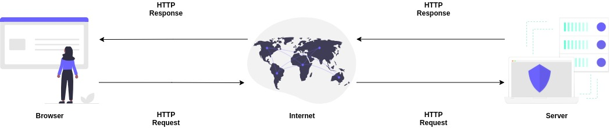

# Web Applications Today

Dynamic websites provide tailored user experiences based on information known or given by the user. The user usually has to authenticate to access the website and is authorized to use the services it provides. In this case, the dynamic website contains information about the user, and there is therefore a great deal more for the attacker to steal. The fundamental difference to static web pages is that a dynamic webpage/website contains functionality that can be compromised. Breaching the security of the server itself is no longer necessary. It is sufficient to discover the security hole in the dynamic website functionality. We, therefore, need to look at the security of a web application itself. A dynamic website can be considered to be a web application.

Web applications introduce a new range of threats, or a new security perimeter, to put it another way. Depending on the setup, web applications are commonly located in an internal network or in the demilitarized zone, which therefore renders network level defenses ineffective. Network, services and operating system level defenses may have been perfectly set in place, but the system would still be vulnerable to a break-in. Web applications commonly interact with internal systems, such as database servers. The network level firewall could be blocking all traffic, but for web applications, it will have to allow HTTP and HTTPS traffic. An attacker might therefore be able to bypass all network-level defenses.

# Types of Vulnerabilities

These days, web applications are very complex being composed of multiple libraries, frameworks and using multiple external services. Each component can have vulnerabilities.
Types of vulnerabilities:

- System vulnerabilities - applications or services that run inside an Operating System or an Operating System vulnerability
- Runtime vulnerabilities - when one of the components (frameworks such as PHP, Java, Python, WordPress, etc.) of the web application is vulnerable leads to a risk.
- Browser vulnerabilities - occasionally attackers will discover a vulnerability in the browser itself that allows execution of arbitrary binary code when a user simply visits a compromised site. Browsers are complex pieces of machinery with many subsystems (HTML rendering, JavaScript engine, CSS parser, image parsers, etc.), and a small coding mistake in any of these systems could offer malicious code just enough of a foothold to get running.
- Vulnerabilities in web application implementation - here we can talk about OWASP Top Ten vulnerabilities [[3]](https://owasp.org/www-project-top-ten/).

# HTTP (Hypertext Transfer Protocol)

## HTTP Request / Response

Communication between clients and servers is done by requests and responses:

- A client (a browser) sends an HTTP request to the web
- An web server receives the request
- The server runs an application to process the request
- The server returns an HTTP response (output) to the browser
- The client (the browser) receives the response

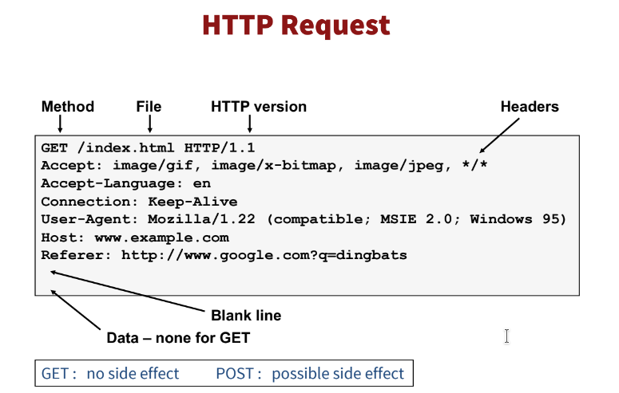

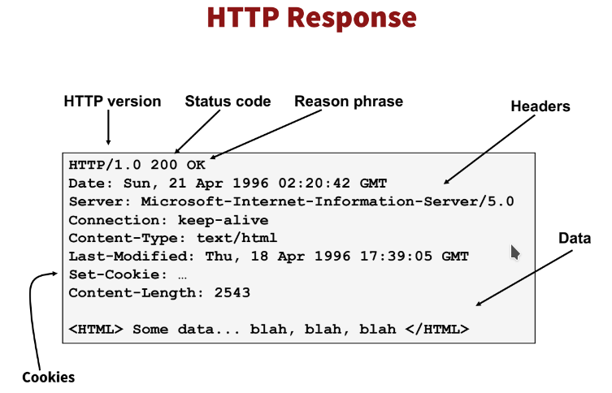

### Basic format of the request:

VERB /resource/locator HTTP/1.1  
Header1: Value1  
Header2: Value2  
…

<Body of the request>  
  
Header is separated from the body by 2 CRLF sequences

### Request Headers:

- **Host:** Indicates the desired host handling the request
- **Accept:** Indicates what MIME type(s) are accepted by the client; often used to specify JSON or XML output for web-services
- **Cookie:** Passes cookie data to the server
- **Referer:** Page leading to this request (note: this is not passed to other servers when using HTTPS on the origin)
- **Authorization:** Used for basic auth pages (mainly). Takes the form “Basic <base64’d username:password>”

### HTTP Request Circle

A typical HTTP request / response circle:

1. The browser requests an HTML page. The server returns an HTML file.
2. The browser requests a style sheet. The server returns a CSS file.
3. The browser requests a JPEG image. The server returns a JPG file.
4. The browser requests JavaScript code. The server returns a JS file
5. The browser requests data. The server returns data (in XML or JSON).

### XHR - XMLHttpRequest

All browsers have a built-in XMLHttpRequest Object (XHR).
XHR is a JavaScript object that is used to transfer data between a web browser and a web server.
XHR is often used to request and receive data for the purpose of modifying a web page.
Despite the XML and HTTP in the name, XHR is used with other protocols than HTTP, and the data can be of many different types like HTML, CSS, XML, JSON, and plain text.

The XHR Object is a Web Developers Dream, because you can:

- Update a web page without reloading the page
- Request data from a server - after the page has loaded
- Receive data from a server - after the page has loaded
- Send data to a server - in the background

The XHR Object is the underlying concept of AJAX and JSON:

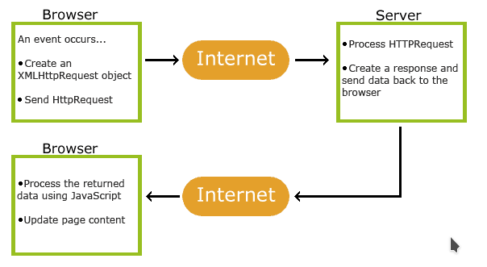

### HTTP Response Codes

- 1xx -> Informational responses
- 2xx -> Successful responses
- 3xx -> Redirects
- 4xx -> Client errors
- 5xx -> Server errors

xx = [00, 01 … 99]

### URL (Uniform Resource Locator)

With Hypertext and HTTP, URL is one of the key concepts of the Web. It is the mechanism used by browsers to retrieve any published resource on the web.

URL stands for Uniform Resource Locator. A URL is nothing more than the address of a given unique resource on the Web. In theory, each valid URL points to a unique resource. Such resources can be an HTML page, a CSS document, an image, etc. In practice, there are some exceptions, the most common being a URL pointing to a resource that no longer exists or that has moved. As the resource represented by the URL and the URL itself are handled by the Web server, it is up to the owner of the web server to carefully manage that resource and its associated URL.

A URL incorporates the domain name, along with other detailed information, to create a complete address (or “web address”) to direct a browser to a specific page online called a web page. In essence, it’s a set of directions and every web page has a unique one.

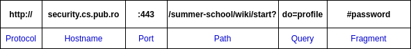

Special characters are encoded as hex:

- **%0A** = newline
- **%20** or + = space, **%2B** = + (special exception)

# Browser

A web browser (commonly referred to as a browser) is a software application for accessing the information on the World Wide Web. When a user requests a web page from a particular website, the web browser retrieves the necessary content from a web server and then displays the page on the screen.

A list of Web Browsers: Google Chrome, Mozilla Firefox, Edge, Internet Explorer, Safari, Opera, Netscape, etc.

## Browser execution model

Each browser windows or frame:

- Loads content
- Renders it
  - Processes HTML and scripts to display page
  - May involve images, subframes, etc.
- Responds to events such as:
  - User actions: OnClick, OnMouseover
  - Rendering: OnLoad, OnBeforeUnload
  - Timing: setTimeout(), clearTimeout()

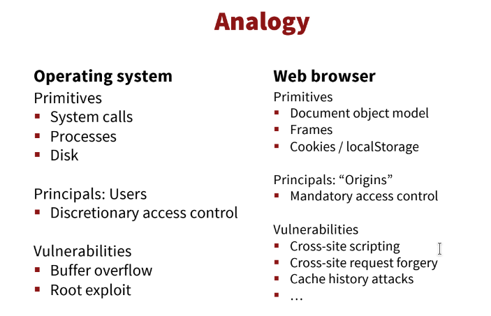

Examples of browser vulnerabilities:

- Google Chrome
  - CVE-2019-5795 https://nvd.nist.gov/vuln/detail/CVE-2019-5795
- Mozilla Firefox
  - CVE-2019-11716 https://nvd.nist.gov/vuln/detail/CVE-2019-11716

# Developer Tools

Modern browsers, such as Google Chrome, Mozilla Firefox and Microsoft Edge, include some functionality aimed at developers for easier debugging, testing and previews.
Anyone can use these tools to look at the internals of a web page.
As a security professional, or even a hobbyist, these instruments provide you with insightful information about the inner workings of any web application out there.
Even if it can only show the front-end code, it can create an overview of the structure and maybe reveal valuable details, such as the traffic sent from and received by the client.

In order to open these tools, you can press _F12_ while navigating a web page in any browser mentioned, or by using _Mouse Right Click_ and selecting the Inspect Element option. The latter lets you select which part of the page should be in focus when inspected.

Alternatively, you can see the entire HTML code of a web page by selecting View Page Source in the Mouse Right Click context menu.

Next, some of the core functionalities of these tools will be detailed (some names may vary slightly across browsers, but the functionality is mainly the same, so we will focus in Google Chrome here):

- **Elements**: In this tab you can see the HTML structure of the page. On the right panel, you can see the styles applied to each element when selected and add, remove or edit the properties directly from there.
  This kind of inspection could lead to the discovery of hidden elements which can be toggled into view by altering the CSS code or could lead to the discovery of commented pieces of code which could contain sensitive data.
  Also, the [DOM](https://github.com/hexcellents/sss-web/wiki/Session-01:-Web-Basics-&-Browser-Security-Model#dom-document-object-model) (Document Object Model) structure of the page can be altered, and elements can be added or removed, such as scripts, input fields, etc. (any element in fact), which means that any JavaScript code used to sanitize user input or perform other functions can be bypassed.

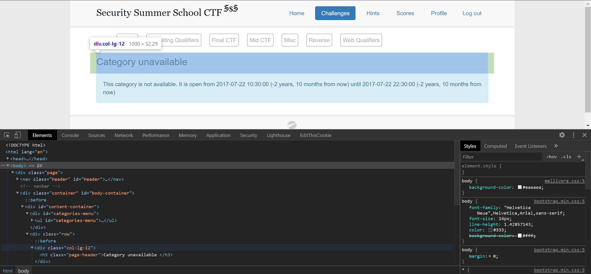

- **Console**: The console prints errors which occurred during page rendering or during any action performed on the page, such as, but not limited to, error loading an image not found, error while performing an asynchronous request to fetch data, missing included file (such as CSS or Javascript files), errors in Javascript code from the included scripts, debug messages left by the developer, etc.
  The console also has the ability to run any Javascript code by typing it directly there and interacting with the page.

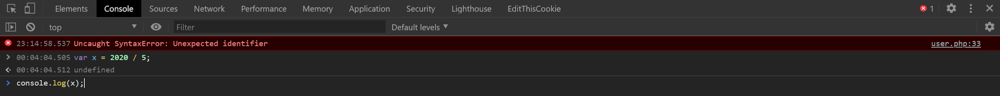

- **Sources**: This tab lets you see any file loaded in the front-end, such as images, JS, CSS etc. in an arborescent way.
  This could be a good tool to inspect the JS scripts included in the current page.
  They could reveal possibly valuable information, such as hidden paths or resources, or even critical pieces of functionality, which, if understood, could lead to successful exploits.

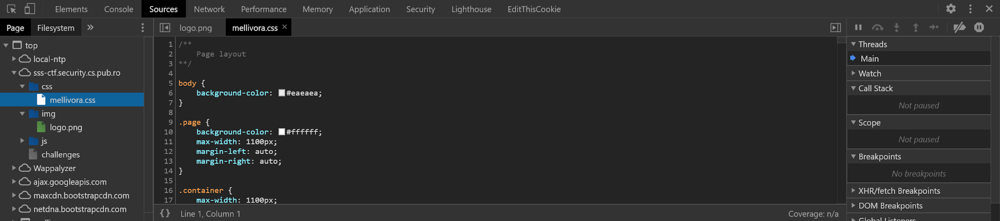

- **Network**: The network tab shows detailed information about every file loaded and every request and response made by the page. You can find in-depth info about the [HTTP requests](https://github.com/hexcellents/sss-web/wiki/Session-01:-Web-Basics-&-Browser-Security-Model#http-hypertext-transfer-protocol), such as HTTP parameters, HTTP methods (GET, POST), HTTP status codes (200, 404, 500, etc.), loading time and size of each loaded element (image, script, etc).
  Furthermore, clicking on one of the requests there, you can see the headers, the preview, the response (as raw content) and others.
  This is useful for listing all the resources needed by a page, such as if there are any requests to APIs, additional scripts loaded, etc.

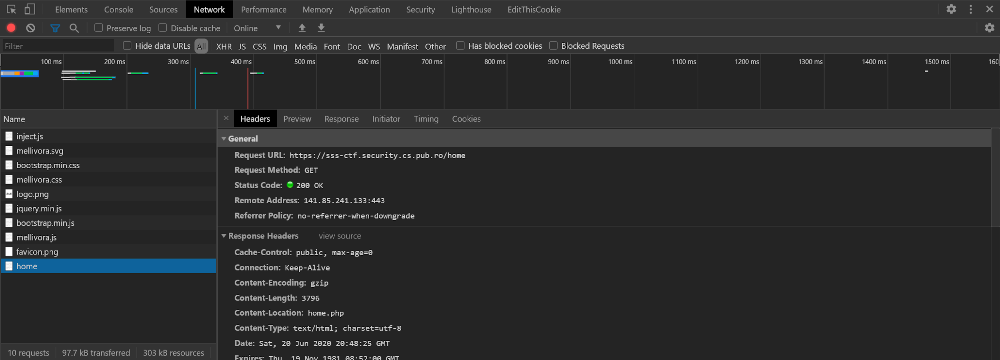

- **Application**: This tab lets you see some specific data about the page, such as cookies (which will be covered in depth in the next section), local storage, session storage, cache, etc.
  This can be useful to see which data is stored on the client-side and it may contain useful values.

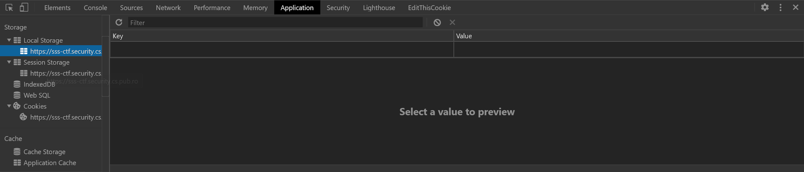

- **Security**: Detailed information about the protocol used (HTTP or HTTPS) and the website certificates.
  Insecure websites can be vulnerable because HTTP sends data in plain text across the connection, which may be intercepted (e.g. Man in the Middle).

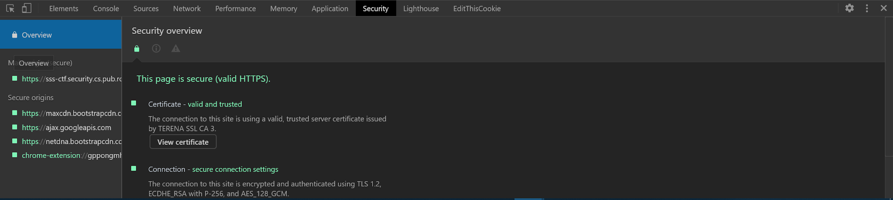

# DOM (Document Object Model)

The Document Object Model connects web pages to scripts or programming languages by representing the structure of a document, such as the HTML representing a web page, in memory. Usually, that means JavaScript, although modeling HTML, SVG, or XML documents as objects are not part of the core JavaScript language, as such.

Object-oriented interface used to read and write docs

- Web page in HTML in structured data
- DOM provides a representation of this hierarchy

The DOM represents a document with a logical tree. Each branch of the tree ends in a node, and each node contains objects. DOM methods allow programmatic access to the tree. With them, you can change the document's structure, style, or content.

Nodes can also have event handlers attached to them. Once an event is triggered, the event handlers get executed. DOM is an application programming interface. Use the DOM when we interact with web pages.

- Add content to a HTML document
- Delete content from a HTML document
- Change Content on a HTML document

Every element within your document is an object: \<head\> tag, \<body\> tag, etc. In javascript we can call methods on objects, we can call properties on objects in order to change the objects.

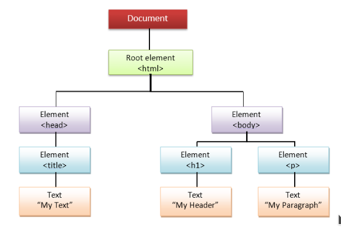

We can introduce nodes, all objects are nodes. We can change the nodes, we can interact with them, create Animations, validations, etc.

The Document interface represents any web page loaded in the browser and serves as an entry point into the web page's content, which is the DOM tree. The DOM tree includes elements such as body and table, among many others. It provides functionality globally to the document, like how to obtain the page's URL and create new elements in the document.

**DOM**

- Object-oriented interface used to read and write docs
- Web page in HTML is structured data
- DOM provides a representation of this hierarchy

**Examples**

- Properties: document.alinkColor, document.URL, document.forms[ ], document.links[], document.anchors[ ]
- Methods: document.write(document.referrer)

**Includes Browser Object Model (BOM)**

- window, document, frames[], history, location, navigator (type
  and version of the browser)

# MIME (Multipurpose Internet Mail Extensions)

MIME is a specification for the format of non-text e-mail attachments that allows the attachment to be sent over the Internet. MIME allows your mail client or Web browser to send and receive things like spreadsheets and audio, video and graphics files via Internet mail. By default, many web servers are configured to report a MIME type of text/plain or application/octet-stream for unknown content types. As new content types are invented or added to web servers, web administrators may fail to add the new MIME types to their web server's configuration. This is a major source of problems for users of Gecko-based browsers, which respect the MIME types as reported by web servers and web applications. Here you can find an example for this type of vulnerability. [[4]](https://github.com/denimgroup/denimgroup-vulnerability-examples)

**MIME Sniffing** - The browser will often not just look at the Content-Type header that the server is passing, but also the contents of the page. If it looks enough like HTML, it’ll be parsed as HTML. => This led to IE 6/7-era bugs where image and text files containing HTML tags would execute as HTML (not so common anymore).

**Encoding Sniffing** - the encoding used on a document will be sniffed by browsers. If you don’t specify an encoding for an HTML document, the browser will apply heuristics to determine it. If you are able to control the way the browser decodes text, you may be able to alter the parsing.

# Security Mechanism

## Isolation - Frames, HTML Sandboxing

### Frame and iFrame

Windows may contain frames from different sources

- Frame: rigid division as part of frameset
- iFrame: floating inline frame

iFrame example:

```
<iframe src="simple_iframe.html" width=450 height=100>
if you can see this, your browser doesn't understand IFRAME.
</iframe>
```

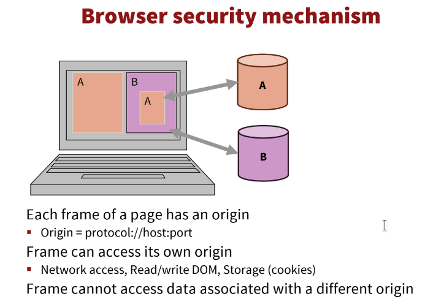

Why use frames?

- Delegate screen area to content from another source
- Browser provides isolation based on frames
- Parent may work even if frame is broken

In order to play a little bit with iframes follow the next instructions:

1. `user@hostname~$: sudo apt install nginx`
2. Change `index.html` file content with the above code
3. `user@hostname~$: sudo service nginx start`
4. Access the browser as http://localhost
5. Solve the problem in order to see the iframe

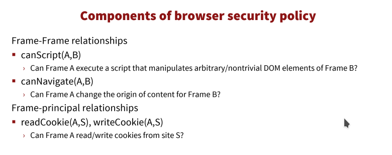

### HTML Sandboxing

The sandbox attribute enables an extra set of restrictions for the content in the iframe.

When the sandbox attribute is present, and it will:

- treat the content as being from a unique origin
- block form submission
- block script execution
- disable APIs
- prevent links from targeting other browsing contexts
- prevent content from using plugins (through \<embed\>, \<object\>, \<applet\> or others)
- prevent the content to navigate its top-level browsing context
- block automatically triggered features (such as automatically playing a video or automatically focusing a form control)

Add the below HTML code in the same index.html as above:

```
<iframe src="sandbox_iframe.html" sandbox width=450 height=100>
if you can see this, your browser doesn't understand SANDBOX IFRAME.
</iframe>
```

Access the page via browser http://localhost.

The value of the sandbox attribute can either be just sandbox (then all restrictions are applied), or a space-separated list of predefined values that will REMOVE the particular restrictions.

# Same-Origin Policy

The same-origin policy is a web browser security mechanism that aims to prevent websites from attacking each other. The same-origin policy restricts scripts on one origin from accessing data from another origin.

## Why do we need Same-Origin Policy?

When a browser sends an HTTP request from one origin to another, any cookies, including authentication session cookies, relevant to the other domain are also sent as part of the request. This means that the response will be generated within the user's session, and include any relevant data that is specific to the user. Without the same-origin policy, if you visited a malicious website, it would be able to read your emails from Gmail and private messages from Facebook. You can read more about SOP here. [[5]](https://portswigger.net/web-security/cors/same-origin-policy)

# Talking to web sites

Let's go through the basics of how HTTP requests are made, using telnet to form requests. First, let's connect to the vulnerable web server:

```
user@hostname~#: telnet 141.85.224.157 80
```

Now let's issue a simple GET. The request is composed of:

- GET <path> <http-version>
- followed by other header contents
- followed by an additional newline, indicating the end of the request.

_Please note the above bullet points and the fact that you need to provide an additional newline to indicate the end of the request._

```
GET / HTTP/1.0
```

```
HEAD / HTTP/1.0
```

```
POST / HTTP/1.0
```

The server's response contains:

- A status code (200 OK in our case)
- Date information and information about the server
- Encoding and other info about the data, i.e. it's MIME-type
- The length of the data
- The actual data

# Tools

## Postman

Postman is a tool through which you can send HTTP requests. It can automate tests and integrate them into CI/CD pipeline. You can simulate endpoints to test without having to set up a backend. It can also monitor certain endpoints to check their health and performance. [[6]](https://www.postman.com/)

## HTTPie

HTTPie is also used to send HTTP requests. It can be used in the terminal, instead of utilities such as **curl** and **wget**. It has an easy syntax, comes with highlighting and JSON assets. [[7]](https://httpie.io/)

## Hoppscotch

Hoppscotch is a tool that you can use from your browser or as a browser extension to quickly test certain endpoints. It also assetss MQTT or GraphQL requests. [[8]](https://hoppscotch.io/)

# Further Reading

- [1] https://skorks.com/2010/05/what-every-developer-should-know-about-urls/
- [2] https://developer.mozilla.org/en-US/docs/Web/HTTP/Methods
- [3] https://owasp.org/www-project-top-ten/
- [4] https://github.com/denimgroup/denimgroup-vulnerability-examples
- [5] https://portswigger.net/web-security/cors/same-origin-policy
- [6] https://www.postman.com/
- [7] https://httpie.io/
- [8] https://hoppscotch.io/

# Activities

**1.** The below image represents a snippet with DevTools containing information about a web application. What can you discover in the next image ? Is there any useful information from a security point of view ? Write the answer to the instructor.


https://imgur.com/a/47j3r5Y

**2.** [Cockroach](https://sss-ctf.security.cs.pub.ro/challenges?category=web-sessions)  
**3.** [Gimme](https://sss-ctf.security.cs.pub.ro/challenges?category=web-sessions)  
**4.** [Surprise](https://sss-ctf.security.cs.pub.ro/challenges?category=web-sessions)  
**5.** [My Special Name](https://sss-ctf.security.cs.pub.ro/challenges?category=web-sessions)  
**6.** [Lame Login](https://sss-ctf.security.cs.pub.ro/challenges?category=web-sessions)  
**7.** [Eyes](https://sss-ctf.security.cs.pub.ro/challenges?category=web-sessions)  
**8.** [Name](https://sss-ctf.security.cs.pub.ro/challenges?category=web-sessions)  
**9.** [Readme](https://sss-ctf.security.cs.pub.ro/challenges?category=web-sessions)  
**10.** [King-Kong](https://sss-ctf.security.cs.pub.ro/challenges?category=web-sessions)  
**11.** [Give to Get](https://sss-ctf.security.cs.pub.ro/challenges?category=web-sessions)  
**12.** [Give to Post](https://sss-ctf.security.cs.pub.ro/challenges?category=web-sessions)  
**13.** [One by One](https://sss-ctf.security.cs.pub.ro/challenges?category=web-sessions)  
**14.** [Produce-consume](https://sss-ctf.security.cs.pub.ro/challenges?category=web-sessions)
